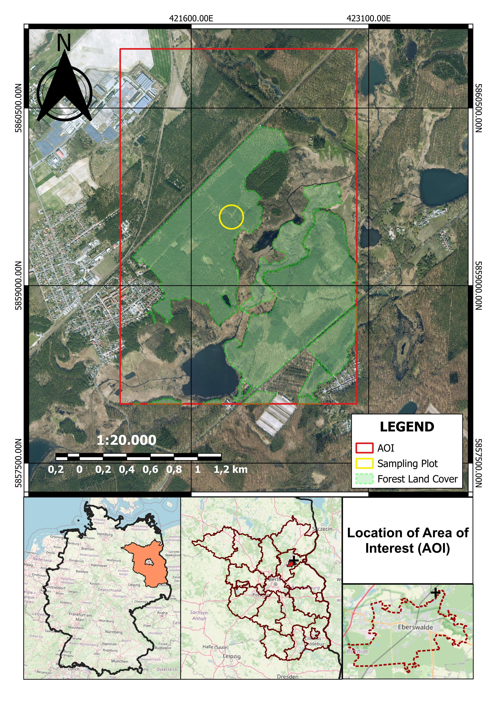

# Foreword

LiDAR (Light Detection and Ranging) is an active remote sensing technology that generates high-resolution three-dimensional point clouds by deploying sensors on various platforms, including ground-based, airborne, and space-based systems. Its primary importance lies in its ability to provide unprecedented metric accuracy for complex structural parameters—such as canopy height, leaf area index, and diameter at breast height (DBH)—while mobile laser scanning (MLS) specifically enhances operational efficiency by acquiring georeferenced data in motion, even in hazardous or GPS-denied environments. In the context of advanced forest management, LiDAR has become the dominant tool for assessing aboveground biomass and individual tree segmentation, offering vast potential for data fusion with spectral sensors to improve species identification and habitat classification (Balestra *et al.*, 2024; Di Stefano *et al.*, 2021).

The importance of LiDAR lies in its ability to provide unprecedented accuracy and detail compared to traditional surveying methods. Its key contributions include:

-   Precision in Measurement: It enables the measurement of complex structural parameters, such as canopy height, leaf area index, and diameter at breast height (DBH), with accuracy that was previously unattainable.

-   Operational Efficiency: Mobile systems significantly reduce the time and human effort required for large-scale data collection compared to static terrestrial scanners.

-   Overcoming Environmental Barriers: LiDAR is essential for mapping challenging or hazardous areas, such as dark underground mines, caves, and tunnels, where GPS signals are denied and traditional line-of-sight is limited.

-   Advanced Forest Management: In forestry, it is the dominant tool for aboveground biomass (AGB) assessments, individual tree segmentation, and fuel load estimates for fire management.

-   Data Fusion Potential: It serves as a foundational dataset that, when fused with multispectral or hyperspectral data, dramatically improves species identification and habitat classification.

According to Balestra *et al.* (2024), LiDAR has revolutionized forestry management by providing highly accurate, three-dimensional characterizations of forest structures that traditional passive sensors cannot achieve. Authors emphasise that LiDAR ability to penetrate the canopy and provide vertical distribution information makes it a dominant tool for both individual tree-level and area-level applications, including crown segmentation, aboveground biomass (AGB) assessments, and canopy height mapping. These capabilities directly support critical management tasks such as tree species identification, structural parameter estimation, and fuel load assessments for wildfire risk mitigation. Furthermore, the review highlights that the integration—or fusion—of LiDAR with other datasets (such as multispectral, hyperspectral, and radar) further enhances the accuracy and temporal resolution of forest attributes, facilitating more precise monitoring of carbon stocks and ecosystem health for sustainable forest resource management. Moreover, authors highlight the potential application of LiDAR analysis:

-   Tree/Crown Segmentation: Precisely delineating individual trees to monitor growth and stand density.

-   Aboveground Biomass (AGB): Calculating total biomass and carbon sequestration potential with high accuracy.

-   Canopy Height & Vertical Structure: Mapping the 3D profile of the forest to assess habitat diversity and timber volume.

-   Fuel Load Assessments: Identifying accumulated vegetation to predict and manage forest fire behavior.

-   Data Fusion: Combining LiDAR with spectral data to improve species classification and health monitoring.

This works documents the theoretical and practical insights gained throughout the Advanced LiDAR Analysis lecture series, bridging the gap between raw spatial data and actionable forest intelligence. Central to this work is a case application analysis of high-density point cloud tiles from Eberswalde, which served as the primary dataset for testing structural estimation techniques. The main objective of this work is to synthesize the concepts lectured during the sessions into a formal case study, establishing a rigorous processing methodology to evaluate and compare the performance of different individual tree segmentation algorithms in a temperate forest environment.

As a case application, ALS data from a region in Brandenburg Federal State were analysed through RStudio by using mainly the lidR package ecosystem to perform a comprehensive Airborne Laser Scanning (ALS) workflow for forest structure assessment in Brandenburg. The processing begins with the ingestion and filtering of multiple .laz tiles, applying a spatial reference system of EPSG:25833 and cleaning noise via Statistical Outlier Removal (SOR). Core data processing involves the generation of high-resolution Digital Terrain Models (DTM), Digital Surface Models (DSM), and Canopy Height Models (CHM) using algorithms such as K-Nearest Neighbour Inverse Distance Weighting (KNN-IDW) and Delaunay Triangulation (DSM-TIN).

Individual tree analysis is executed through height normalization followed by a Local Maximum Filter (LMF) with a dynamic window size to identify tree tops. The methodology emphasizes a comparative evaluation of three distinct crown segmentation algorithms: Dalponte & Coomes (2016), Li *et al.* (2012), and Silva *et al.* (2016). Statistical rigor is ensured through ANOVA and Tukey Post-Hoc tests to determine significant differences in crown area and height metrics across the different segmentation methods. The analysis concludes with the generation and export of tree geometries as ESRI™ Shapefiles (.shp) and raster products as GeoTIFFs (.tif), integrating spatial vector data with sf and raster processing with terra to provide a reproducible bridge between raw LiDAR point clouds and actionable dendrometric statistics.

Results derived from the entire analysis workflow will be presented as a sampling plot level due to volume and storage restrictions. For more information, check the posted script.

# 1. Methodology


``` r
######### 1. Loading packages#######
library(lidR)     
library(sf)       
```

```
## Linking to GEOS 3.13.1, GDAL 3.11.4, PROJ 9.7.0; sf_use_s2() is TRUE
```

```
## 
## Adjuntando el paquete: 'sf'
```

```
## The following object is masked from 'package:lidR':
## 
##     st_concave_hull
```

``` r
library(terra)    
```

```
## terra 1.8.86
```

```
## 
## Adjuntando el paquete: 'terra'
```

```
## The following object is masked from 'package:lidR':
## 
##     watershed
```

``` r
library(tibble)   
library(mapview)  
library(ggplot2)
library(viridis)
```

```
## Cargando paquete requerido: viridisLite
```

``` r
library(units)
```

```
## udunits database from C:/Users/migue/AppData/Local/R/win-library/4.5/units/share/udunits/udunits2.xml
```

``` r
library(writexl)
library(dplyr)
```

```
## 
## Adjuntando el paquete: 'dplyr'
```

```
## The following objects are masked from 'package:terra':
## 
##     intersect, union
```

```
## The following objects are masked from 'package:stats':
## 
##     filter, lag
```

```
## The following objects are masked from 'package:base':
## 
##     intersect, setdiff, setequal, union
```

``` r
library(here)
```

```
## here() starts at D:/PERSONEL/Blog/project/BB-Wald/BB-Wald
```

``` r
library(raster)
```

```
## Cargando paquete requerido: sp
```

```
## 
## Adjuntando el paquete: 'sp'
```

```
## The following object is masked from 'package:lidR':
## 
##     wkt
```

```
## 
## Adjuntando el paquete: 'raster'
```

```
## The following object is masked from 'package:dplyr':
## 
##     select
```

```
## The following objects are masked from 'package:lidR':
## 
##     projection, projection<-
```

``` r
library(report)
library(tmap)
library(tmaptools)
```
## 1.1 Study area

The Area of Interest (AOI, [Figure 1](#Figure1)) is located on the northeastern outskirts of Eberswalde, within the Barnim district of Brandenburg, Germany, situated at the geographic transition between the Eberswalde Glacial Valley and the Barnim Nature Park. This 6 km^2^ study site is formally defined by six Brandenburg Geoportal LiDAR tiles—[als_33421-5858, als_33421-5859, als_33421-5860, als_33422-5858, als_33422-5859 and als_33422-5860](#LGB)—encompassing a diverse landscape of managed forest, water bodies, and complex glacial topography. The area serves as a primary site for forestry research and topographic analysis, characterized by the heterogeneous canopy structures and varying elevations typical of the region's terminal moraine landscape.


``` r
######### 1. Loading vector files #######
aoi <- st_read("shp/aoi.shp") #AOI
```

```
## Reading layer `aoi' from data source 
##   `D:\PERSONEL\Blog\project\BB-Wald\BB-Wald\shp\aoi.shp' using driver `ESRI Shapefile'
## Simple feature collection with 1 feature and 4 fields
## Geometry type: POLYGON
## Dimension:     XY
## Bounding box:  xmin: 420999.7 ymin: 5858000 xmax: 423000 ymax: 5861000
## Projected CRS: ETRS89 / UTM zone 33N
```

``` r
forest <- st_read("shp/foreststands.shp") #Forest land cover, it was clipped before
```

```
## Reading layer `foreststands' from data source 
##   `D:\PERSONEL\Blog\project\BB-Wald\BB-Wald\shp\foreststands.shp' 
##   using driver `ESRI Shapefile'
## Simple feature collection with 1 feature and 22 fields
## Geometry type: MULTIPOLYGON
## Dimension:     XY
## Bounding box:  xmin: 421105.2 ymin: 5858000 xmax: 422999.9 ymax: 5860350
## Projected CRS: ETRS89 / UTM zone 33N
```

``` r
plot <- st_read("shp/plot.shp")
```

```
## Reading layer `plot' from data source 
##   `D:\PERSONEL\Blog\project\BB-Wald\BB-Wald\shp\plot.shp' using driver `ESRI Shapefile'
## Simple feature collection with 1 feature and 3 fields
## Geometry type: POLYGON
## Dimension:     XY
## Bounding box:  xmin: 421840 ymin: 5859480 xmax: 422040 ymax: 5859680
## Projected CRS: ETRS89 / UTM zone 33N
```

``` r
#For border-effect, a 1 m buffer will be generated for forest areas
wald <- st_buffer(forest, dist = 1)
```

``` r
#Figure 1. Area of Interest.
mapview(aoi)
```


```{=html}
<div class="leaflet html-widget html-fill-item" id="htmlwidget-8233b5a3ec056758ddec" style="width:672px;height:480px;"></div>
<script type="application/json" data-for="htmlwidget-8233b5a3ec056758ddec">{"x":{"options":{"minZoom":1,"maxZoom":52,"crs":{"crsClass":"L.CRS.EPSG3857","code":null,"proj4def":null,"projectedBounds":null,"options":{}},"preferCanvas":false,"bounceAtZoomLimits":false,"maxBounds":[[[-90,-370]],[[90,370]]]},"calls":[{"method":"addProviderTiles","args":["CartoDB.Positron","CartoDB.Positron","CartoDB.Positron",{"errorTileUrl":"","noWrap":false,"detectRetina":false,"pane":"tilePane"}]},{"method":"addProviderTiles","args":["CartoDB.DarkMatter","CartoDB.DarkMatter","CartoDB.DarkMatter",{"errorTileUrl":"","noWrap":false,"detectRetina":false,"pane":"tilePane"}]},{"method":"addProviderTiles","args":["OpenStreetMap","OpenStreetMap","OpenStreetMap",{"errorTileUrl":"","noWrap":false,"detectRetina":false,"pane":"tilePane"}]},{"method":"addProviderTiles","args":["Esri.WorldImagery","Esri.WorldImagery","Esri.WorldImagery",{"errorTileUrl":"","noWrap":false,"detectRetina":false,"pane":"tilePane"}]},{"method":"addProviderTiles","args":["OpenTopoMap","OpenTopoMap","OpenTopoMap",{"errorTileUrl":"","noWrap":false,"detectRetina":false,"pane":"tilePane"}]},{"method":"createMapPane","args":["polygon",420]},{"method":"addPolygons","args":[[[[{"lng":[13.82620225937647,13.82571173619189,13.85543923201708,13.85614594073387,13.82644486658656,13.82644469978358,13.82620225937647],"lat":[52.87490377821128,52.89288179774,52.89316984242252,52.86620888181653,52.86591621821567,52.86591621655118,52.87490377821128]}]]],null,"aoi",{"crs":{"crsClass":"L.CRS.EPSG3857","code":null,"proj4def":null,"projectedBounds":null,"options":{}},"pane":"polygon","stroke":true,"color":"#333333","weight":0.5,"opacity":0.9,"fill":true,"fillColor":"#6666FF","fillOpacity":0.6,"smoothFactor":1,"noClip":false},"<div class='scrollableContainer'><table class=mapview-popup id='popup'><tr class='coord'><td><\/td><th><b>Feature ID&emsp;<\/b><\/th><td>1&emsp;<\/td><\/tr><tr><td>1<\/td><th>fid&emsp;<\/th><td>11&emsp;<\/td><\/tr><tr><td>2<\/td><th>Analysis.a&emsp;<\/th><td>11&emsp;<\/td><\/tr><tr><td>3<\/td><th>area&emsp;<\/th><td>6.000111&emsp;<\/td><\/tr><tr><td>4<\/td><th>perimeter&emsp;<\/th><td>10.00019&emsp;<\/td><\/tr><tr><td>5<\/td><th>geometry&emsp;<\/th><td>sfc_POLYGON&emsp;<\/td><\/tr><\/table><\/div>",{"maxWidth":800,"minWidth":50,"autoPan":true,"keepInView":false,"closeButton":true,"closeOnClick":true,"className":""},"1",{"interactive":false,"permanent":false,"direction":"auto","opacity":1,"offset":[0,0],"textsize":"10px","textOnly":false,"className":"","sticky":true},{"stroke":true,"weight":1,"opacity":0.9,"fillOpacity":0.84,"bringToFront":false,"sendToBack":false}]},{"method":"addScaleBar","args":[{"maxWidth":100,"metric":true,"imperial":true,"updateWhenIdle":true,"position":"bottomleft"}]},{"method":"addHomeButton","args":[13.82571173619189,52.86591621655118,13.85614594073387,52.89316984242252,true,"aoi","Zoom to aoi","<strong> aoi <\/strong>","bottomright"]},{"method":"addLayersControl","args":[["CartoDB.Positron","CartoDB.DarkMatter","OpenStreetMap","Esri.WorldImagery","OpenTopoMap"],"aoi",{"collapsed":true,"autoZIndex":true,"position":"topleft"}]},{"method":"addLegend","args":[{"colors":["#6666FF"],"labels":["aoi"],"na_color":null,"na_label":"NA","opacity":1,"position":"topright","type":"factor","title":"","extra":null,"layerId":null,"className":"info legend","group":"aoi"}]}],"limits":{"lat":[52.86591621655118,52.89316984242252],"lng":[13.82571173619189,13.85614594073387]},"fitBounds":[52.86591621655118,13.82571173619189,52.89316984242252,13.85614594073387,[]]},"evals":[],"jsHooks":{"render":[{"code":"function(el, x, data) {\n  return (\n      function(el, x, data) {\n      // get the leaflet map\n      var map = this; //HTMLWidgets.find('#' + el.id);\n      // we need a new div element because we have to handle\n      // the mouseover output separately\n      // debugger;\n      function addElement () {\n      // generate new div Element\n      var newDiv = $(document.createElement('div'));\n      // append at end of leaflet htmlwidget container\n      $(el).append(newDiv);\n      //provide ID and style\n      newDiv.addClass('lnlt');\n      newDiv.css({\"position\":\"relative\",\"bottomleft\":\"0px\",\"background-color\":\"rgba(255, 255, 255, 0.7)\",\"box-shadow\":\"0 0 2px #bbb\",\"background-clip\":\"padding-box\",\"margin\":\"0\",\"padding-left\":\"5px\",\"padding-right\":\"5px\",\"color\":\"#333\",\"font-size\":\"9px\",\"font-family\":\"\\\"Helvetica Neue\\\", Arial, Helvetica, sans-serif\",\"text-align\":\"left\",\"z-index\":\"700\"});\n      return newDiv;\n      }\n\n\n      // check for already existing lnlt class to not duplicate\n      var lnlt = $(el).find('.lnlt');\n\n      if(!lnlt.length) {\n      lnlt = addElement();\n\n      // grab the special div we generated in the beginning\n      // and put the mousmove output there\n\n      map.on('mousemove', function (e) {\n      if (e.originalEvent.ctrlKey) {\n      if (document.querySelector('.lnlt') === null) lnlt = addElement();\n      lnlt.text(\n                           ' lon: ' + (e.latlng.lng).toFixed(5) +\n                           ' | lat: ' + (e.latlng.lat).toFixed(5) +\n                           ' | zoom: ' + map.getZoom() +\n                           ' | x: ' + L.CRS.EPSG3857.project(e.latlng).x.toFixed(0) +\n                           ' | y: ' + L.CRS.EPSG3857.project(e.latlng).y.toFixed(0) +\n                           ' | epsg: 3857 ' +\n                           ' | proj4: +proj=merc +a=6378137 +b=6378137 +lat_ts=0.0 +lon_0=0.0 +x_0=0.0 +y_0=0 +k=1.0 +units=m +nadgrids=@null +no_defs ');\n      } else {\n      if (document.querySelector('.lnlt') === null) lnlt = addElement();\n      lnlt.text(\n                      ' lon: ' + (e.latlng.lng).toFixed(5) +\n                      ' | lat: ' + (e.latlng.lat).toFixed(5) +\n                      ' | zoom: ' + map.getZoom() + ' ');\n      }\n      });\n\n      // remove the lnlt div when mouse leaves map\n      map.on('mouseout', function (e) {\n      var strip = document.querySelector('.lnlt');\n      if( strip !==null) strip.remove();\n      });\n\n      };\n\n      //$(el).keypress(67, function(e) {\n      map.on('preclick', function(e) {\n      if (e.originalEvent.ctrlKey) {\n      if (document.querySelector('.lnlt') === null) lnlt = addElement();\n      lnlt.text(\n                      ' lon: ' + (e.latlng.lng).toFixed(5) +\n                      ' | lat: ' + (e.latlng.lat).toFixed(5) +\n                      ' | zoom: ' + map.getZoom() + ' ');\n      var txt = document.querySelector('.lnlt').textContent;\n      console.log(txt);\n      //txt.innerText.focus();\n      //txt.select();\n      setClipboardText('\"' + txt + '\"');\n      }\n      });\n\n      }\n      ).call(this.getMap(), el, x, data);\n}","data":null},{"code":"function(el, x, data) {\n  return (function(el,x,data){\n           var map = this;\n\n           map.on('keypress', function(e) {\n               console.log(e.originalEvent.code);\n               var key = e.originalEvent.code;\n               if (key === 'KeyE') {\n                   var bb = this.getBounds();\n                   var txt = JSON.stringify(bb);\n                   console.log(txt);\n\n                   setClipboardText('\\'' + txt + '\\'');\n               }\n           })\n        }).call(this.getMap(), el, x, data);\n}","data":null}]}}</script>
```


``` r
#Figure 2. Forest cover inside AOI.
mapview(forest)
```

```{=html}
<div class="leaflet html-widget html-fill-item" id="htmlwidget-52363bb27ce659209413" style="width:672px;height:480px;"></div>
<script type="application/json" data-for="htmlwidget-52363bb27ce659209413">{"x":{"options":{"minZoom":1,"maxZoom":52,"crs":{"crsClass":"L.CRS.EPSG3857","code":null,"proj4def":null,"projectedBounds":null,"options":{}},"preferCanvas":false,"bounceAtZoomLimits":false,"maxBounds":[[[-90,-370]],[[90,370]]]},"calls":[{"method":"addProviderTiles","args":["CartoDB.Positron","CartoDB.Positron","CartoDB.Positron",{"errorTileUrl":"","noWrap":false,"detectRetina":false,"pane":"tilePane"}]},{"method":"addProviderTiles","args":["CartoDB.DarkMatter","CartoDB.DarkMatter","CartoDB.DarkMatter",{"errorTileUrl":"","noWrap":false,"detectRetina":false,"pane":"tilePane"}]},{"method":"addProviderTiles","args":["OpenStreetMap","OpenStreetMap","OpenStreetMap",{"errorTileUrl":"","noWrap":false,"detectRetina":false,"pane":"tilePane"}]},{"method":"addProviderTiles","args":["Esri.WorldImagery","Esri.WorldImagery","Esri.WorldImagery",{"errorTileUrl":"","noWrap":false,"detectRetina":false,"pane":"tilePane"}]},{"method":"addProviderTiles","args":["OpenTopoMap","OpenTopoMap","OpenTopoMap",{"errorTileUrl":"","noWrap":false,"detectRetina":false,"pane":"tilePane"}]},{"method":"createMapPane","args":["polygon",420]},{"method":"addPolygons","args":[[[[{"lng":[13.85590136252778,13.8557801026171,13.85567358556575,13.85549939241131,13.85530062288464,13.8555776427338,13.85568740101671,13.85581844744285,13.85576822899331,13.85574266043891,13.85569073808878,13.85564936873849,13.85565785934415,13.85566994684318,13.85576444572185,13.85582528442096,13.855928026396,13.85593253125005,13.85535528153216,13.85545779840282,13.85552989584893,13.85567049481046,13.85554600548064,13.85550598361325,13.84944077521371,13.84893163912303,13.84393297613245,13.84375006855854,13.84366354525647,13.84360841844969,13.84339253867016,13.84226146072836,13.84215169493609,13.84121403288987,13.84119127600692,13.84103406096647,13.84090739488581,13.8407077703799,13.84067773575673,13.84110568069273,13.84129368679763,13.84135960463293,13.84125255410349,13.84141285109763,13.8415052652249,13.84157482859516,13.84157849177052,13.84168977941274,13.84171828581034,13.841713262846,13.84170141002807,13.84160826946048,13.84151219805543,13.84123644249904,13.84080223926303,13.84039750018201,13.84037354099756,13.84004916908917,13.83981247351606,13.83950006556413,13.83930731201149,13.83945080759574,13.83968522423617,13.84008003672475,13.8407818636073,13.84147147207861,13.8409616650192,13.84121405124156,13.84143984555768,13.84166504354936,13.84184125663822,13.84199099495582,13.84204418264867,13.84206886002992,13.84216277608757,13.84225657142335,13.84228400681183,13.84229766397217,13.84228509544711,13.84243603619208,13.84254685218273,13.84265191741304,13.84273098359902,13.84287809020558,13.84304711981223,13.84314594435075,13.84320715476941,13.84312545022254,13.84375771578408,13.84382408302922,13.84415207817268,13.84437058063896,13.84471941618886,13.84498283859147,13.84511640885693,13.84539471628839,13.84549583109054,13.84577546950407,13.84590391100014,13.84598274819345,13.84597484374113,13.84590765542655,13.84580106290322,13.84562186565315,13.84532275375068,13.84480225934113,13.84441856102287,13.84430152145296,13.84421766793468,13.84419227875377,13.84421624407264,13.84426705242902,13.84435667196973,13.84454380710257,13.84479922354478,13.84504745449718,13.84537067710609,13.84564226404103,13.84612555502557,13.84645622315855,13.84665917353022,13.84705848232672,13.84730995410557,13.84765055632413,13.84766912568529,13.84793185785515,13.84829426990818,13.8484816541326,13.8489681047394,13.84902321849903,13.84920005881042,13.84945429729293,13.84973417601208,13.84979410381293,13.84983317361301,13.84987512516531,13.84999402855114,13.84954716100409,13.84933418131165,13.84915929182385,13.84915141344857,13.8492840738092,13.84936999894392,13.84952494557906,13.84969008430115,13.84979793946233,13.8500223879109,13.85016162241486,13.85027138205728,13.85035549963859,13.85048433576155,13.85060467508353,13.85055044858292,13.85049164554674,13.85044674818086,13.8504470155237,13.85061908852865,13.85088797025146,13.85120893930256,13.85151935858388,13.8519549921309,13.85221139267482,13.85228567727363,13.85308645193739,13.85378282533581,13.85417273001337,13.85419225004351,13.85428780873506,13.85485882351668,13.8553107710069,13.85546541747439,13.85571059911539,13.85586776984136,13.85590136252778],"lat":[52.87554443907399,52.87555206012348,52.87550608324445,52.87549091942714,52.87542157782755,52.87519949511529,52.87526348352936,52.87522429073923,52.87515638109102,52.87499880788015,52.87485446587686,52.8747327008041,52.87469232714398,52.87465648319647,52.87459446302044,52.87454110856989,52.87452693002065,52.87435501603581,52.87405111344884,52.87396669552972,52.87390895468474,52.87378894315927,52.87372031767862,52.87368846659245,52.8704338714204,52.8701637297026,52.86748106323352,52.86737589589762,52.86731872572448,52.8672864402527,52.86741286957205,52.86675615905277,52.86669242670031,52.86623639864168,52.8662541568231,52.8662062468787,52.86629056869803,52.8663295106469,52.86660542300984,52.86658157182566,52.86686790999953,52.86704932943333,52.86723144075739,52.86770635494459,52.86792609159293,52.86795341787942,52.86795320998309,52.86794690391355,52.8681415503396,52.86823747904777,52.86846381305345,52.86846338455857,52.86846294268062,52.86846167432664,52.86886648724816,52.86886253551805,52.86906457941822,52.86925020399058,52.86949062509709,52.86992359356712,52.87046561233735,52.87065580747971,52.87077946493491,52.87087771747253,52.87102391855191,52.87065306323449,52.87027050314537,52.87027746134628,52.87030663488313,52.87049762441212,52.87099379996399,52.87122900346668,52.87132391841516,52.87137360472274,52.87147341181185,52.87157771270741,52.87166338634398,52.87170847009965,52.87204098207307,52.87223124606668,52.87253349528007,52.87277275748147,52.87287241935294,52.87292779447858,52.87299686639092,52.8729124230262,52.87284559341426,52.87270545062177,52.87281499484098,52.87283362125619,52.87293121044433,52.87295581229636,52.87296819659132,52.87297974913484,52.872985543267,52.87327593328993,52.87338479777179,52.87376510096288,52.87396413183719,52.87407278027304,52.87409068279064,52.87424286180496,52.87448006389726,52.87465362933361,52.87486648321411,52.87516259091054,52.87534315516922,52.87541393623695,52.87549403209188,52.87561065648007,52.87568730569981,52.875872097527,52.87599433621747,52.87608156322096,52.87611551347558,52.87614040318362,52.87613905028297,52.87612371121977,52.87624977456633,52.8763878386812,52.87643925549696,52.8765105586947,52.87655345534129,52.87659721726349,52.87659739745001,52.87663590608328,52.87669785705135,52.8767760900998,52.87706399439074,52.87708700383174,52.87714265826786,52.87722153758658,52.8773141498686,52.87743609675622,52.87750390095891,52.87760319843063,52.87788304321627,52.87792366560155,52.87811039443164,52.87826153157997,52.878418782096,52.87859986971424,52.87872206958682,52.87890337194569,52.87912073413211,52.8792566303474,52.87947906150848,52.87955233050077,52.8796163238767,52.8796665837706,52.87985212800601,52.88007804531938,52.88030227305079,52.88041857522824,52.88057097238591,52.88070133145244,52.88079739298613,52.88088540090846,52.88083007045925,52.88075216187182,52.88071591842412,52.88071390168445,52.8807146195994,52.88049760314831,52.88015371234227,52.8798787817821,52.87984300971509,52.87949081758433,52.87738615128669,52.87715227070592,52.87706335406096,52.87692238127793,52.87682626833638,52.87554443907399]},{"lng":[13.84242688888634,13.84279736599877,13.84214529374303,13.84217086776043,13.84181916010242,13.8416464749716,13.84166190691827,13.84171642473364,13.84215169493609,13.84242688888634],"lat":[52.86704558991653,52.86753641190864,52.86771339118218,52.86775611440443,52.86783642309842,52.86734156720862,52.86722681490703,52.86681982414491,52.86669242670031,52.86704558991653]}],[{"lng":[13.85599805901603,13.85580272152207,13.85577738828614,13.85585929796381,13.85570800474668,13.85568673176473,13.85514006246045,13.85507711260301,13.85478290131486,13.85490239390356,13.85488686009458,13.85481914794595,13.85485758279927,13.85505474219026,13.85512406778964,13.85497513533385,13.8548828509362,13.85479191327655,13.8543985027239,13.85425948876633,13.85416637787401,13.8540272909349,13.85379584702635,13.85347864547479,13.85328283573783,13.85328114582439,13.85321143852018,13.85262497958139,13.85236987438061,13.85152749232982,13.85150788083432,13.85093920326656,13.85066233365395,13.85039569808449,13.84984638812765,13.84980031888794,13.85559000303572,13.85589133368348,13.85595094237559,13.85599805901603],"lat":[52.871854150483,52.87158763963654,52.87142107938902,52.87099034326982,52.87079972183905,52.8707729178023,52.87051592547719,52.87047016032432,52.87025626331713,52.87009109854913,52.86983473051113,52.86972619615983,52.86967712118301,52.86966553804778,52.86957180935461,52.86944451176669,52.86928179981385,52.86920900192082,52.86905687028597,52.86883527124392,52.86870401613424,52.86862625795951,52.86852962794342,52.86844565466966,52.8683234401929,52.86832414398203,52.86835318224627,52.86859750530067,52.86875635877758,52.86930127764749,52.86931350242565,52.86966797518104,52.8698378916116,52.87000152529173,52.87035144165273,52.87040412702942,52.87346002855796,52.87361953166562,52.87365239344336,52.871854150483]}],[{"lng":[13.84881595472694,13.84887722280323,13.8488623690125,13.84923701947457,13.84932218116957,13.84950735677957,13.84975410872738,13.84992083864328,13.85006252813249,13.85061977771763,13.85078098100744,13.85089248988279,13.85121279074974,13.8515496008305,13.84881595472694],"lat":[52.86613734554653,52.86627893842232,52.86663522587491,52.86662458092791,52.86663439633202,52.86665417085803,52.86673297738402,52.8667480775208,52.86672697444004,52.86644019064054,52.86638331509864,52.86637989918199,52.86648638476533,52.86616407722158,52.86613734554653]}],[{"lng":[13.84176968708656,13.84362016226035,13.84482780229607,13.84599945875469,13.84505938101938,13.84176968708656],"lat":[52.86606815148684,52.86709510086411,52.86699200630835,52.86690221478639,52.8661005082034,52.86606815148684]}],[{"lng":[13.83684806696558,13.8370799424136,13.83734188072812,13.83763651587332,13.83827298716491,13.83833215484118,13.83874329287716,13.83896312606227,13.83924017737367,13.83684806696558],"lat":[52.86601957326133,52.86611507196435,52.86618056792642,52.86627335467688,52.86636049360168,52.86637006258669,52.86637996358228,52.86623097113181,52.86604320977176,52.86601957326133]}],[{"lng":[13.82999628953362,13.83007565039448,13.83056116646508,13.83087580131364,13.83139727589738,13.83167417899928,13.83188436996866,13.83220045596115,13.83239042118065,13.83262277192958,13.83269379963507,13.83275320733203,13.83311949125895,13.83319447421831,13.83342660737904,13.83404428531872,13.83419424956682,13.83418681847428,13.82999628953362],"lat":[52.86595160385093,52.86596985210378,52.86614544736588,52.86618450618276,52.86626605556857,52.86632721626977,52.86638322500292,52.86636835374014,52.86634774648297,52.86640846686939,52.86639118485147,52.86639176884326,52.86630546746723,52.8662792338811,52.8662095935589,52.86616621447094,52.86611374607255,52.8659932207399,52.86595160385093]}],[{"lng":[13.82814027727065,13.82821187583607,13.82838804007987,13.8286400345912,13.82888750950639,13.82899781377005,13.82814027727065],"lat":[52.86593312418846,52.86594697940401,52.86602513302363,52.86604560031751,52.86595813989893,52.86594166598515,52.86593312418846]}],[{"lng":[13.83211561037318,13.83195460198181,13.83127472715664,13.83045203634636,13.83028183852656,13.83033810061413,13.83038735119736,13.8302187384321,13.83043082451901,13.83043270261115,13.8304371631702,13.83051513611496,13.83078351710435,13.83106242439185,13.83109258761252,13.83130518507538,13.83126938991485,13.83133064682979,13.8313769801922,13.83144360786329,13.83151320899665,13.83187775409306,13.83174951111011,13.8316826829586,13.83150226106963,13.8317992309685,13.83188516151776,13.83167784350955,13.8315945856781,13.83156249855889,13.83140105606913,13.83122831515294,13.83115858978787,13.8310596273485,13.83101563106555,13.83106960638637,13.83120544312138,13.8313339735914,13.83151328868416,13.83145661630932,13.8305903347015,13.83005330175652,13.82987932121226,13.82974320400491,13.82957305668501,13.82931987256731,13.82915836122953,13.82899083543908,13.82859736664781,13.82823921978516,13.82804372313678,13.82797525248292,13.82775657569777,13.82770756803981,13.82794150057853,13.82824107366225,13.82817264827714,13.82932821442609,13.82943051160096,13.83005124517764,13.83024841756645,13.83035430911551,13.83085455025251,13.83138402830981,13.83238095528476,13.83303456774762,13.83339983515948,13.83440041553546,13.83513537469258,13.83540102573514,13.83573696506728,13.83598532779086,13.83640897420236,13.83743157024634,13.83843598530012,13.83946235901344,13.83951340122806,13.84044490516302,13.84052518771114,13.84147852830615,13.84250139828108,13.84325694823542,13.84332273600106,13.84358037242087,13.84371446290252,13.84608109955837,13.84608960307354,13.84656526153993,13.84719438150958,13.84658240403364,13.84649802463544,13.84649838249237,13.84611412346297,13.84575643145345,13.84531116899397,13.84480104903805,13.84437084145101,13.84427271075507,13.84422131392605,13.84417410019236,13.84381041477784,13.84304160679657,13.8426718271266,13.84264989774473,13.84223375071023,13.84194174146365,13.84171180515978,13.84164314094712,13.84213594869431,13.84290505806415,13.84356127962446,13.84376507259947,13.84347823475661,13.84317903236242,13.84330974894921,13.84369315406453,13.84388988133035,13.84386422323431,13.84380718666307,13.84380143187104,13.84381208794407,13.84374726481632,13.84370173013499,13.8436044364396,13.84384501207773,13.84344302430353,13.84321381850341,13.84304116928603,13.84282454970569,13.84254718500312,13.84241850730145,13.84213516492281,13.84200804787518,13.84170924411539,13.84130776252166,13.84121862423928,13.84108491716782,13.84066930441804,13.84036894894631,13.84028113110304,13.84043029394701,13.84051008848729,13.84049343868145,13.84032020596875,13.84029612663041,13.84014302858629,13.8402349765281,13.84057120932919,13.84064740600723,13.84070395413921,13.8408410791528,13.8410100450621,13.84109810100835,13.84105161914039,13.84100746920689,13.84095039017721,13.84089444516179,13.84077788376277,13.84070433235787,13.84097435436786,13.84074063740731,13.84073800228177,13.84080544618364,13.84107546070893,13.84111768327814,13.84133049995024,13.84134142832861,13.8415067148098,13.84154420981723,13.84145316824157,13.84141195821001,13.84123586327566,13.84117968050872,13.84100717875443,13.84082365557696,13.8407786132359,13.84080688498659,13.84088762588543,13.84077502251889,13.84060934925376,13.83989192454426,13.83855712967117,13.83851088730931,13.83845721637321,13.83823726748298,13.83817928894232,13.83785175963667,13.83762414224647,13.83756601494188,13.83745435434789,13.83716826311606,13.8370748219113,13.83663207513859,13.83623446400396,13.83589363760656,13.83572867386905,13.83541456269864,13.83509314355991,13.83478963611804,13.83468343918712,13.8344262343136,13.83428463398601,13.83414160969509,13.83411238268217,13.8338961712534,13.83375637963186,13.83361861400476,13.83333864532234,13.83310372201973,13.83256765971094,13.8325513845057,13.83258196541778,13.83262356615657,13.83271703586522,13.83265405291026,13.83263119535234,13.83259517314103,13.83261063208804,13.83264574165791,13.83293768856031,13.8327178835948,13.83267012793773,13.83249021832587,13.83242050688041,13.83227691622727,13.83218887938071,13.83198714505445,13.83185080388924,13.83201920924646,13.83211561037318],"lat":[52.87243136476813,52.87247922689289,52.87276022178197,52.87310273724477,52.87317306644249,52.87321188441062,52.87324484904395,52.87335216297674,52.87349599125858,52.87349444457404,52.8734976440408,52.87343590358412,52.87357249926381,52.87370393871761,52.87371717242114,52.87381042478538,52.87383976689756,52.87386811329348,52.87388948929056,52.8738358292869,52.87377977476554,52.87395359828433,52.87406141395717,52.87403081038811,52.87417327282467,52.87430789993247,52.87434758257086,52.8745287978542,52.87448696575365,52.87453920632898,52.87466812742718,52.87480607107754,52.87486175201695,52.87494078196841,52.87497590573776,52.87500123990797,52.87506101273923,52.87511621844835,52.87521687435736,52.87525227721694,52.87583260309491,52.87618691861693,52.87630207701127,52.87639063610142,52.87650133586195,52.87666066163435,52.87672649620607,52.87687767655115,52.87659060705555,52.87678485654786,52.87689278767181,52.87693058878422,52.87704979713014,52.87707628374426,52.87721793972525,52.87740519355313,52.87746295420389,52.87814411537208,52.87820805460709,52.87860973684453,52.8787375408457,52.87880600973215,52.87913008484739,52.87947242574892,52.88011603493445,52.88054049976785,52.88077333638196,52.88142145917139,52.88189750917901,52.88206957362885,52.88228863012219,52.88244839159458,52.88272224641462,52.88338404394293,52.8840321685879,52.88469398607535,52.88473044525465,52.88532839538421,52.88538311980544,52.88599925503173,52.88665651552758,52.88716732218202,52.88720841834638,52.8871614816299,52.88714930111563,52.88688014101396,52.88683976819679,52.88627801249407,52.88553344755613,52.88535219891106,52.88517157744516,52.88515809577271,52.88535664030506,52.88525427438092,52.88537131075286,52.88513260838233,52.88468341401236,52.88474089388526,52.88485726503873,52.88481635010908,52.88452063096108,52.88409061011961,52.88388472996279,52.88387103110882,52.88359277687146,52.88339664261379,52.88324156850319,52.88247224472239,52.88224330754783,52.88224181331309,52.88187511563143,52.88161638680238,52.88164505924713,52.88116117445947,52.88113547644144,52.88110774557113,52.88097480921945,52.88068238095291,52.88059192461128,52.88052893783093,52.88040767511647,52.8803306280962,52.88022679851552,52.88011347482706,52.88000793582645,52.87961744700658,52.87943541243292,52.8793618097186,52.87926530303918,52.87907830282817,52.87902760302144,52.87920464307449,52.87923486904129,52.87929488587591,52.87930445459801,52.87930358487163,52.87916293252417,52.87872735149693,52.87856709202865,52.87851678885997,52.87835642425138,52.87815042983028,52.87793899958274,52.8776091688788,52.87753701281669,52.87700959588989,52.8769419613288,52.8766946279157,52.87648410407644,52.87631384390068,52.87628900412203,52.87625839582352,52.87546362981921,52.87539575032008,52.87528945451327,52.87515202917766,52.8750211264214,52.87479523569274,52.87421015993873,52.87369586376188,52.87354524545946,52.87350476419223,52.87348294726103,52.87338669136629,52.87337147589082,52.87329478380735,52.8732909860264,52.87323357217331,52.87322045277249,52.87315213869808,52.87316522182501,52.87322193942836,52.87323937143253,52.87330061882231,52.87335726331929,52.87337480387951,52.87328967370796,52.8731870763385,52.87295223313222,52.87303602190631,52.87263794507822,52.87199109386924,52.87205357245805,52.87211597836728,52.87231659542741,52.87236947808369,52.8726719374221,52.87284951213272,52.87321753823905,52.87336478220915,52.87364517001465,52.87366673030242,52.87355451222415,52.87369895426727,52.87380349429193,52.87386031287875,52.87393814397886,52.87401140750177,52.87404172927097,52.87405233841223,52.87408577468879,52.87410236502774,52.87403353502553,52.87401526783307,52.87390526340562,52.87385444492794,52.87386657706777,52.87391776765369,52.87395141996622,52.87385624997721,52.87377068376785,52.87360017198153,52.87343426357724,52.87327336008279,52.87312889891747,52.87301180255325,52.87283164586434,52.87280932251361,52.87274673675388,52.87266420009031,52.87244047705425,52.87239186727696,52.87231368161115,52.87228153076019,52.87209582119556,52.87205449987191,52.87209746645912,52.87219501677923,52.8722865745677,52.87243136476813]},{"lng":[13.84003385062917,13.83989500392251,13.83990853551917,13.83957141838013,13.8388879816635,13.83909816183889,13.83964889163357,13.84001385409211,13.84014993796448,13.84015940027387,13.84013400148308,13.84003385062917],"lat":[52.87372264118058,52.87391457245371,52.87410349717898,52.87448677860006,52.87426582770486,52.87402783104554,52.8735988423991,52.87335834594165,52.87340912081874,52.87347214408588,52.87358876759103,52.87372264118058]}],[{"lng":[13.83006023718961,13.83028722925888,13.83038641863255,13.83059791921301,13.83076508352834,13.83059527505899,13.83023440110285,13.83001556597986,13.8296662174593,13.82960408087239,13.83006023718961],"lat":[52.87295555362147,52.87279670817188,52.87278124041188,52.87241717960207,52.87213151543737,52.87209274018061,52.87278959982789,52.87289615982911,52.87280446756444,52.87288422964038,52.87295555362147]}],[{"lng":[13.8416589696499,13.84179397717535,13.84199680136112,13.84236825666801,13.84227038408483,13.8416589696499],"lat":[52.8730957105442,52.87318692857695,52.87310794066131,52.87296328017494,52.87287242483531,52.8730957105442]}],[{"lng":[13.8499485224718,13.84963063027622,13.84932353940916,13.84902352346656,13.84893730218904,13.84872897377523,13.85100399078649,13.8513852039098,13.85141167148698,13.85222832384317,13.85239443264219,13.85254857099068,13.85312008732208,13.8531689511153,13.85283267515467,13.85251188471185,13.8522282268842,13.85157013836066,13.85144213159713,13.85127822655521,13.85114274102054,13.85114559055109,13.85107067034986,13.8508166058094,13.85067752838447,13.8505655119265,13.85076464770184,13.85098609149441,13.85111794702251,13.85093072050077,13.85079764586215,13.85063308564381,13.85048566466712,13.85031932144614,13.8501387193907,13.8499485224718],"lat":[52.86682476168734,52.86680414271549,52.86676440667706,52.86671681362455,52.86670313546756,52.86673638408266,52.86946908349744,52.86923902932403,52.86922130509996,52.86867630916429,52.86857452825246,52.86850409685231,52.86823991452828,52.86821791026311,52.86801238532745,52.86792387970996,52.86783573214112,52.86772148793003,52.86769659685704,52.86766472366876,52.86759149196629,52.86748363718988,52.86722669477137,52.86714332517941,52.86706556310765,52.86694760727161,52.86672028660814,52.86663252836647,52.86656188410021,52.86647916048643,52.8664553973618,52.86649875525007,52.86659621956573,52.86670698567986,52.86679513728275,52.86682476168734]}],[{"lng":[13.84594238380232,13.84562142748693,13.84468182713356,13.8442631096995,13.84401832844519,13.84435241828295,13.84556651811048,13.84508109766013,13.84558000293052,13.84500113731841,13.84446624240197,13.84399952912156,13.84355004366279,13.84293776993446,13.84239126844091,13.84213502752456,13.84146059739668,13.84122256692948,13.84247634407947,13.84292521142813,13.84253998672909,13.84324369612467,13.84320166882215,13.84367921982071,13.84375638220692,13.84369116035887,13.84369112752861,13.84369242606578,13.84412422143548,13.84446732484516,13.84496951315749,13.84537674024311,13.84577712492002,13.84605888822185,13.84678517739592,13.84694288650765,13.84684874464084,13.84640030756012,13.8454711290408,13.84525418052853,13.84534370145161,13.84573537399672,13.8460576919873,13.84610545183243,13.84611668737272,13.84643601508127,13.84684818280618,13.84743277936419,13.84765610044063,13.84784645456605,13.84822096590883,13.84869839969885,13.84937314271106,13.84889901689091,13.84945239615466,13.8498551928049,13.84890202534504,13.84903048020515,13.84917877357564,13.85086142170259,13.85309179980072,13.85382310261823,13.85340796398132,13.85394242871124,13.85309928438703,13.85197568473624,13.85109971380828,13.85055463921407,13.85026644349416,13.850374929146,13.8504469861744,13.85029235780873,13.8496878518924,13.84890088257859,13.84940252697313,13.84972935680564,13.84967178142551,13.848902826167,13.84848670103097,13.84777780220169,13.84677815425561,13.84594238380232],"lat":[52.8762929452234,52.8762089147469,52.87619977751325,52.87602039603906,52.87558648805344,52.87517619439697,52.87463960612677,52.87459443072026,52.87413179570213,52.87396883999448,52.87382878460447,52.87391863851978,52.8736400635468,52.87347677236318,52.87335457471108,52.87321272970902,52.87338224228784,52.87344206763722,52.87406562340342,52.87394863122179,52.87502369126255,52.87538116255401,52.87584374411875,52.87632487107314,52.87649643454088,52.87713375682452,52.87713409723014,52.87713427169577,52.87719225406684,52.87700230653457,52.87669703213662,52.87688978451271,52.87692064696518,52.87680201865913,52.87715069791115,52.87750733861682,52.87769521681948,52.877654901139,52.8779515352732,52.87814720838341,52.87841328704903,52.87863285716094,52.87894614821582,52.87929960526508,52.87938274167151,52.87966903225244,52.87981687680609,52.87997217050585,52.88003149132613,52.87985803115284,52.87974479253416,52.87967300692638,52.88014703073513,52.88065487205373,52.88108276926584,52.88158562146742,52.88208432746796,52.88214400809601,52.88257696999258,52.88273260955889,52.88296993177865,52.88228924940694,52.88197058878519,52.88142735162676,52.88141921224837,52.88105774226668,52.88102679607864,52.88084621478058,52.88064564194591,52.88033653452643,52.88000010318112,52.87966597251373,52.87934546512583,52.87833993810799,52.8777739276201,52.87777709370654,52.87742592184784,52.87714427264511,52.87686604012925,52.87670183729389,52.87657526263054,52.8762929452234]}]]],null,"forest",{"crs":{"crsClass":"L.CRS.EPSG3857","code":null,"proj4def":null,"projectedBounds":null,"options":{}},"pane":"polygon","stroke":true,"color":"#333333","weight":0.5,"opacity":0.9,"fill":true,"fillColor":"#6666FF","fillOpacity":0.6,"smoothFactor":1,"noClip":false},"<div class='scrollableContainer'><table class=mapview-popup id='popup'><tr class='coord'><td><\/td><th><b>Feature ID&emsp;<\/b><\/th><td>1&emsp;<\/td><\/tr><tr><td>1<\/td><th>fid&emsp;<\/th><td>1208&emsp;<\/td><\/tr><tr><td>2<\/td><th>OBJECTID&emsp;<\/th><td>299759&emsp;<\/td><\/tr><tr><td>3<\/td><th>HH_OBF&emsp;<\/th><td>8&emsp;<\/td><\/tr><tr><td>4<\/td><th>HH_REV&emsp;<\/th><td>1&emsp;<\/td><\/tr><tr><td>5<\/td><th>EB&emsp;<\/th><td>NA&emsp;<\/td><\/tr><tr><td>6<\/td><th>FB_OBF&emsp;<\/th><td>NA&emsp;<\/td><\/tr><tr><td>7<\/td><th>FB_REV&emsp;<\/th><td>NA&emsp;<\/td><\/tr><tr><td>8<\/td><th>WAG&emsp;<\/th><td>297&emsp;<\/td><\/tr><tr><td>9<\/td><th>ABT&emsp;<\/th><td>412&emsp;<\/td><\/tr><tr><td>10<\/td><th>UAA&emsp;<\/th><td>y&emsp;<\/td><\/tr><tr><td>11<\/td><th>TF&emsp;<\/th><td>7&emsp;<\/td><\/tr><tr><td>12<\/td><th>BHE&emsp;<\/th><td>1&emsp;<\/td><\/tr><tr><td>13<\/td><th>NA.&emsp;<\/th><td>28&emsp;<\/td><\/tr><tr><td>14<\/td><th>EA&emsp;<\/th><td>C&emsp;<\/td><\/tr><tr><td>15<\/td><th>FLAE&emsp;<\/th><td>0.2800312&emsp;<\/td><\/tr><tr><td>16<\/td><th>ADRESSE&emsp;<\/th><td>12|8|1|297|412|y|7|1&emsp;<\/td><\/tr><tr><td>17<\/td><th>GlobalID&emsp;<\/th><td>{DA8B965A-F3EF-4D6E-9CA1-26A011F712DE}&emsp;<\/td><\/tr><tr><td>18<\/td><th>Shape_Leng&emsp;<\/th><td>218.8693&emsp;<\/td><\/tr><tr><td>19<\/td><th>Shape_Area&emsp;<\/th><td>2800.312&emsp;<\/td><\/tr><tr><td>20<\/td><th>area&emsp;<\/th><td>202.824&emsp;<\/td><\/tr><tr><td>21<\/td><th>perimeter&emsp;<\/th><td>20.902&emsp;<\/td><\/tr><tr><td>22<\/td><th>area_m2&emsp;<\/th><td>2028235&emsp;<\/td><\/tr><tr><td>23<\/td><th>geometry&emsp;<\/th><td>sfc_MULTIPOLYGON&emsp;<\/td><\/tr><\/table><\/div>",{"maxWidth":800,"minWidth":50,"autoPan":true,"keepInView":false,"closeButton":true,"closeOnClick":true,"className":""},"1",{"interactive":false,"permanent":false,"direction":"auto","opacity":1,"offset":[0,0],"textsize":"10px","textOnly":false,"className":"","sticky":true},{"stroke":true,"weight":1,"opacity":0.9,"fillOpacity":0.84,"bringToFront":false,"sendToBack":false}]},{"method":"addScaleBar","args":[{"maxWidth":100,"metric":true,"imperial":true,"updateWhenIdle":true,"position":"bottomleft"}]},{"method":"addHomeButton","args":[13.82770756803981,52.86593312418846,13.85599805901603,52.88720841834638,true,"forest","Zoom to forest","<strong> forest <\/strong>","bottomright"]},{"method":"addLayersControl","args":[["CartoDB.Positron","CartoDB.DarkMatter","OpenStreetMap","Esri.WorldImagery","OpenTopoMap"],"forest",{"collapsed":true,"autoZIndex":true,"position":"topleft"}]},{"method":"addLegend","args":[{"colors":["#6666FF"],"labels":["forest"],"na_color":null,"na_label":"NA","opacity":1,"position":"topright","type":"factor","title":"","extra":null,"layerId":null,"className":"info legend","group":"forest"}]}],"limits":{"lat":[52.86593312418846,52.88720841834638],"lng":[13.82770756803981,13.85599805901603]},"fitBounds":[52.86593312418846,13.82770756803981,52.88720841834638,13.85599805901603,[]]},"evals":[],"jsHooks":{"render":[{"code":"function(el, x, data) {\n  return (\n      function(el, x, data) {\n      // get the leaflet map\n      var map = this; //HTMLWidgets.find('#' + el.id);\n      // we need a new div element because we have to handle\n      // the mouseover output separately\n      // debugger;\n      function addElement () {\n      // generate new div Element\n      var newDiv = $(document.createElement('div'));\n      // append at end of leaflet htmlwidget container\n      $(el).append(newDiv);\n      //provide ID and style\n      newDiv.addClass('lnlt');\n      newDiv.css({\"position\":\"relative\",\"bottomleft\":\"0px\",\"background-color\":\"rgba(255, 255, 255, 0.7)\",\"box-shadow\":\"0 0 2px #bbb\",\"background-clip\":\"padding-box\",\"margin\":\"0\",\"padding-left\":\"5px\",\"padding-right\":\"5px\",\"color\":\"#333\",\"font-size\":\"9px\",\"font-family\":\"\\\"Helvetica Neue\\\", Arial, Helvetica, sans-serif\",\"text-align\":\"left\",\"z-index\":\"700\"});\n      return newDiv;\n      }\n\n\n      // check for already existing lnlt class to not duplicate\n      var lnlt = $(el).find('.lnlt');\n\n      if(!lnlt.length) {\n      lnlt = addElement();\n\n      // grab the special div we generated in the beginning\n      // and put the mousmove output there\n\n      map.on('mousemove', function (e) {\n      if (e.originalEvent.ctrlKey) {\n      if (document.querySelector('.lnlt') === null) lnlt = addElement();\n      lnlt.text(\n                           ' lon: ' + (e.latlng.lng).toFixed(5) +\n                           ' | lat: ' + (e.latlng.lat).toFixed(5) +\n                           ' | zoom: ' + map.getZoom() +\n                           ' | x: ' + L.CRS.EPSG3857.project(e.latlng).x.toFixed(0) +\n                           ' | y: ' + L.CRS.EPSG3857.project(e.latlng).y.toFixed(0) +\n                           ' | epsg: 3857 ' +\n                           ' | proj4: +proj=merc +a=6378137 +b=6378137 +lat_ts=0.0 +lon_0=0.0 +x_0=0.0 +y_0=0 +k=1.0 +units=m +nadgrids=@null +no_defs ');\n      } else {\n      if (document.querySelector('.lnlt') === null) lnlt = addElement();\n      lnlt.text(\n                      ' lon: ' + (e.latlng.lng).toFixed(5) +\n                      ' | lat: ' + (e.latlng.lat).toFixed(5) +\n                      ' | zoom: ' + map.getZoom() + ' ');\n      }\n      });\n\n      // remove the lnlt div when mouse leaves map\n      map.on('mouseout', function (e) {\n      var strip = document.querySelector('.lnlt');\n      if( strip !==null) strip.remove();\n      });\n\n      };\n\n      //$(el).keypress(67, function(e) {\n      map.on('preclick', function(e) {\n      if (e.originalEvent.ctrlKey) {\n      if (document.querySelector('.lnlt') === null) lnlt = addElement();\n      lnlt.text(\n                      ' lon: ' + (e.latlng.lng).toFixed(5) +\n                      ' | lat: ' + (e.latlng.lat).toFixed(5) +\n                      ' | zoom: ' + map.getZoom() + ' ');\n      var txt = document.querySelector('.lnlt').textContent;\n      console.log(txt);\n      //txt.innerText.focus();\n      //txt.select();\n      setClipboardText('\"' + txt + '\"');\n      }\n      });\n\n      }\n      ).call(this.getMap(), el, x, data);\n}","data":null},{"code":"function(el, x, data) {\n  return (function(el,x,data){\n           var map = this;\n\n           map.on('keypress', function(e) {\n               console.log(e.originalEvent.code);\n               var key = e.originalEvent.code;\n               if (key === 'KeyE') {\n                   var bb = this.getBounds();\n                   var txt = JSON.stringify(bb);\n                   console.log(txt);\n\n                   setClipboardText('\\'' + txt + '\\'');\n               }\n           })\n        }).call(this.getMap(), el, x, data);\n}","data":null}]}}</script>
```


``` r
#Figure 3. Sampling plot location inside AOI.
mapview(plot)
```

```{=html}
<div class="leaflet html-widget html-fill-item" id="htmlwidget-ceeed5ac5311eda763bf" style="width:672px;height:480px;"></div>
<script type="application/json" data-for="htmlwidget-ceeed5ac5311eda763bf">{"x":{"options":{"minZoom":1,"maxZoom":52,"crs":{"crsClass":"L.CRS.EPSG3857","code":null,"proj4def":null,"projectedBounds":null,"options":{}},"preferCanvas":false,"bounceAtZoomLimits":false,"maxBounds":[[[-90,-370]],[[90,370]]]},"calls":[{"method":"addProviderTiles","args":["CartoDB.Positron","CartoDB.Positron","CartoDB.Positron",{"errorTileUrl":"","noWrap":false,"detectRetina":false,"pane":"tilePane"}]},{"method":"addProviderTiles","args":["CartoDB.DarkMatter","CartoDB.DarkMatter","CartoDB.DarkMatter",{"errorTileUrl":"","noWrap":false,"detectRetina":false,"pane":"tilePane"}]},{"method":"addProviderTiles","args":["OpenStreetMap","OpenStreetMap","OpenStreetMap",{"errorTileUrl":"","noWrap":false,"detectRetina":false,"pane":"tilePane"}]},{"method":"addProviderTiles","args":["Esri.WorldImagery","Esri.WorldImagery","Esri.WorldImagery",{"errorTileUrl":"","noWrap":false,"detectRetina":false,"pane":"tilePane"}]},{"method":"addProviderTiles","args":["OpenTopoMap","OpenTopoMap","OpenTopoMap",{"errorTileUrl":"","noWrap":false,"detectRetina":false,"pane":"tilePane"}]},{"method":"createMapPane","args":["polygon",420]},{"method":"addPolygons","args":[[[[{"lng":[13.84000321853972,13.84002915124098,13.84005508334976,13.84008100696639,13.84010691419379,13.84013279713988,13.84015864791998,13.84018445865921,13.84021022149489,13.84023592857892,13.84026157208021,13.84028714418702,13.84031263710939,13.84033804308145,13.84036335436386,13.84038856324611,13.84041366204889,13.84043864312642,13.84046349886882,13.84048822170436,13.84051280410184,13.84053723857281,13.84056151767392,13.84058563400914,13.84060958023206,13.84063334904807,13.84065693321661,13.8406803255534,13.8407035189326,13.84072650628898,13.84074928062009,13.84077183498837,13.84079416252329,13.84081625642342,13.84083810995853,13.8408597164716,13.8408810693809,13.84090216218193,13.84092298844946,13.84094354183946,13.84096381609105,13.84098380502837,13.8410035025625,13.84102290269331,13.84104199951126,13.84106078719924,13.84107926003429,13.84109741238941,13.84111523873522,13.84113273364166,13.84114989177965,13.84116670792272,13.84118317694858,13.84119929384069,13.8412150536898,13.84123045169543,13.84124548316734,13.84126014352695,13.84127442830875,13.84128833316165,13.84130185385029,13.84131498625636,13.84132772637985,13.84134007034022,13.84135201437767,13.84136355485419,13.84137468825474,13.84138541118828,13.84139572038882,13.84140561271642,13.84141508515811,13.84142413482886,13.84143275897241,13.84144095496216,13.8414487203019,13.84145605262664,13.8414629497033,13.84146940943137,13.84147542984358,13.8414810091065,13.84148614552108,13.84149083752315,13.84149508368395,13.84149888271051,13.84150223344609,13.84150513487049,13.84150758610039,13.84150958638959,13.84151113512927,13.84151223184817,13.84151287621268,13.84151306802703,13.84151280723328,13.84151209391135,13.84151092827903,13.84150931069185,13.84150724164305,13.84150472176336,13.84150175182083,13.84149833272063,13.84149446550471,13.84149015135154,13.84148539157571,13.84148018762756,13.84147454109272,13.84146845369161,13.84146192727895,13.8414549638432,13.84144756550588,13.84143973452104,13.84143147327446,13.84142278428298,13.84141367019376,13.84140413378339,13.84139417795711,13.84138380574793,13.84137302031565,13.84136182494595,13.84135022304935,13.84133821816019,13.84132581393558,13.84131301415422,13.84129982271531,13.84128624363733,13.84127228105682,13.84125793922713,13.84124322251712,13.84122813540981,13.84121268250105,13.84119686849809,13.84118069821816,13.84116417658699,13.84114730863734,13.84113009950741,13.84111255443935,13.84109467877759,13.84107647796727,13.84105795755254,13.84103912317489,13.84101998057143,13.84100053557315,13.84098079410312,13.84096076217472,13.84094044588977,13.8409198514367,13.84089898508866,13.84087785320161,13.84085646221235,13.84083481863663,13.8408129290671,13.84079080017132,13.84076843868975,13.84074585143369,13.84072304528318,13.84070002718493,13.8406768041502,13.84065338325265,13.84062977162622,13.84060597646291,13.84058200501063,13.84055786457097,13.84053356249699,13.84050910619097,13.84048450310215,13.84045976072449,13.84043488659436,13.84040988828824,13.84038477342044,13.84035954964077,13.8403342246322,13.84030880610854,13.84028330181206,13.84025771951115,13.84023206699798,13.84020635208608,13.84018058260799,13.84015476641287,13.84012891136409,13.84010302533688,13.84007711621587,13.84005119189276,13.84002526026386,13.83999932922769,13.83997340668262,13.83994750052441,13.83992161864384,13.83989576892429,13.83986995923937,13.83984419745045,13.83981849140437,13.83979284893095,13.83976727784066,13.83974178592226,13.83971638094036,13.83969107063311,13.83966586270984,13.83964076484868,13.83961578469426,13.83959092985534,13.83956620790255,13.83954162636603,13.83951719273315,13.83949291444626,13.83946879890038,13.83944485344098,13.83942108536174,13.8393975019023,13.83937411024609,13.83935091751812,13.83932793078283,13.83930515704191,13.8392826032322,13.83926027622355,13.83923818281674,13.83921632974142,13.83919472365402,13.83917337113579,13.83915227869072,13.83913145274363,13.83911089963813,13.83909062563479,13.83907063690914,13.83905093954984,13.83903153955684,13.83901244283948,13.83899365521476,13.83897518240556,13.83895703003885,13.83893920364402,13.8389217086512,13.83890455038956,13.83888773408574,13.83887126486221,13.83885514773575,13.83883938761591,13.83882398930349,13.8388089574891,13.83879429675174,13.83878001155739,13.83876610625763,13.83875258508837,13.8387394521685,13.83872671149868,13.83871436696008,13.83870242231323,13.83869088119686,13.83867974712682,13.83866902349494,13.83865871356806,13.83864882048703,13.83863934726572,13.83863029679011,13.83862167181743,13.83861347497533,13.83860570876101,13.83859837554055,13.83859147754813,13.83858501688536,13.83857899552064,13.83857341528858,13.83856827788942,13.83856358488849,13.83855933771581,13.83855553766555,13.83855218589571,13.83854928342776,13.83854683114629,13.83854482979876,13.83854327999529,13.83854218220845,13.83854153677312,13.83854134388641,13.83854160360755,13.83854231585793,13.83854348042106,13.83854509694271,13.83854716493096,13.83854968375635,13.83855265265211,13.83855607071437,13.83855993690242,13.83856425003906,13.83856900881093,13.83857421176891,13.83857985732859,13.83858594377073,13.83859246924176,13.83859943175441,13.83860682918823,13.83861465929033,13.83862291967596,13.83863160782934,13.83864072110435,13.83865025672537,13.83866021178813,13.83867058326055,13.83868136798372,13.83869256267284,13.83870416391821,13.83871616818628,13.83872857182071,13.8387413710435,13.83875456195614,13.83876814054079,13.83878210266151,13.83879644406552,13.83881116038448,13.83882624713582,13.83884169972415,13.8388575134426,13.83887368347429,13.83889020489378,13.8389070726686,13.83892428166072,13.83894182662819,13.83895970222669,13.83897790301116,13.83899642343749,13.83901525786415,13.839034400554,13.83905384567592,13.83907358730671,13.83909361943278,13.83911393595207,13.83913453067588,13.8391553973307,13.83917652956024,13.83919792092724,13.83921956491551,13.83924145493191,13.8392635843083,13.83928594630366,13.83930853410607,13.83933134083481,13.83935435954246,13.83937758321703,13.83940100478408,13.83942461710885,13.83944841299849,13.83947238520421,13.83949652642349,13.83952082930233,13.83954528643747,13.83956989037865,13.83959463363088,13.83961950865673,13.83964450787862,13.83966962368112,13.83969484841329,13.83972017439099,13.83974559389925,13.83977109919458,13.83979668250737,13.83982233604424,13.83984805199039,13.83987382251204,13.83989963975875,13.83992549586585,13.83995138295685,13.8399772931458,13.84000321853972],"lat":[52.88114876707662,52.88114888344718,52.88114872600054,52.88114829478465,52.88114758993087,52.88114661165393,52.88114536025181,52.88114383610574,52.88114203968001,52.88113997152186,52.88113763226132,52.88113502261096,52.88113214336578,52.88112899540286,52.88112557968117,52.88112189724121,52.88111794920479,52.88111373677454,52.88110926123371,52.88110452394566,52.88109952635351,52.88109426997967,52.88108875642535,52.88108298737012,52.88107696457142,52.88107068986394,52.8810641651591,52.88105739244454,52.88105037378338,52.88104311131369,52.88103560724782,52.8810278638717,52.88101988354414,52.88101166869619,52.88100322183026,52.88099454551952,52.88098564240698,52.88097651520474,52.88096716669317,52.88095759972008,52.88094781719979,52.8809378221123,52.88092761750233,52.88091720647848,52.88090659221218,52.88089577793677,52.88088476694656,52.88087356259572,52.8808621682974,52.88085058752252,52.88083882379884,52.88082688070986,52.8808147618937,52.88080247104205,52.88079001189893,52.88077738825966,52.88076460396968,52.88075166292334,52.88073856906274,52.88072532637653,52.88071193889872,52.88069841070738,52.88068474592345,52.8806709487095,52.88065702326842,52.88064297384214,52.88062880471038,52.88061452018932,52.88060012463026,52.88058562241834,52.88057101797117,52.88055631573754,52.88054152019596,52.8805266358534,52.88051166724387,52.88049661892703,52.88048149548685,52.88046630153012,52.88045104168516,52.88043572060032,52.88042034294264,52.88040491339635,52.88038943666148,52.88037391745247,52.88035836049665,52.88034277053286,52.88032715230999,52.88031151058554,52.88029585012415,52.88028017569617,52.8802644920762,52.88024880404163,52.88023311637118,52.8802174338435,52.8802017612356,52.88018610332152,52.88017046487077,52.880154850647,52.88013926540637,52.8801237138963,52.88010820085389,52.88009273100452,52.88007730906041,52.8800619397192,52.88004662766244,52.88003137755432,52.88001619404007,52.88000108174469,52.87998604527144,52.87997108920052,52.87995621808758,52.87994143646244,52.87992674882765,52.87991215965708,52.87989767339465,52.8798832944529,52.87986902721172,52.87985487601689,52.87984084517894,52.87982693897165,52.87981316163088,52.87979951735322,52.87978601029472,52.87977264456962,52.87975942424916,52.8797463533602,52.87973343588414,52.87972067575564,52.87970807686142,52.87969564303906,52.87968337807593,52.87967128570787,52.8796593696182,52.87964763343654,52.8796360807377,52.87962471504058,52.87961353980717,52.87960255844135,52.87959177428808,52.87958119063208,52.87957081069716,52.87956063764497,52.87955067457419,52.8795409245195,52.87953139045074,52.87952207527193,52.87951298182042,52.87950411286602,52.87949547111018,52.87948705918509,52.87947887965301,52.87947093500534,52.87946322766199,52.87945575997055,52.87944853420563,52.87944155256815,52.87943481718465,52.87942833010671,52.87942209331021,52.87941610869485,52.87941037808348,52.87940490322163,52.87939968577686,52.87939472733836,52.87939002941646,52.87938559344208,52.8793814207664,52.87937751266035,52.87937387031434,52.87937049483777,52.87936738725877,52.8793645485239,52.8793619794978,52.87935968096298,52.87935765361955,52.87935589808502,52.87935441489408,52.87935320449852,52.87935226726701,52.87935160348501,52.87935121335472,52.87935109699495,52.87935125444113,52.87935168564533,52.87935239047619,52.879353368719,52.87935462007583,52.87935614416551,52.87935794052381,52.87936000860358,52.8793623477749,52.87936495732527,52.87936783645984,52.87937098430164,52.87937439989189,52.8793780821902,52.87938203007499,52.87938624234376,52.87939071771348,52.87939545482099,52.87940045222341,52.87940570839856,52.87941122174545,52.87941699058477,52.87942301315935,52.87942928763477,52.87943581209989,52.87944258456737,52.87944960297438,52.87945686518316,52.87946436898169,52.87947211208436,52.8794800921327,52.87948830669597,52.87949675327213,52.87950542928837,52.87951433210204,52.8795234590014,52.87953280720641,52.8795423738697,52.87955215607729,52.87956215084957,52.87957235514218,52.87958276584693,52.87959337979279,52.87960419374678,52.879615204415,52.87962640844366,52.87963780242004,52.87964938287358,52.87966114627691,52.8796730890469,52.87968520754586,52.87969749808249,52.87970995691312,52.87972258024284,52.87973536422655,52.87974830497032,52.87976139853239,52.87977464092446,52.87978802811291,52.87980155602,52.87981522052515,52.87982901746611,52.87984294264038,52.87985699180628,52.87987116068446,52.87988544495901,52.87989984027896,52.87991434225945,52.87992894648314,52.87994364850154,52.87995844383638,52.87997332798096,52.87998829640148,52.88000334453854,52.88001846780839,52.88003366160444,52.88004892129855,52.88006424224255,52.88007961976962,52.88009504919565,52.88011052582074,52.88012604493065,52.88014160179809,52.88015719168437,52.88017280984071,52.88018845150965,52.88020411192666,52.88021978632142,52.88023546991937,52.88025115794315,52.88026684561405,52.88028252815343,52.88029820078425,52.88031385873246,52.88032949722849,52.88034511150866,52.8803606968167,52.88037624840516,52.88039176153679,52.88040723148615,52.88042265354088,52.88043802300321,52.88045333519141,52.88046858544116,52.88048376910707,52.88049888156391,52.88051391820827,52.88052887445972,52.88054374576238,52.88055852758622,52.88057321542846,52.88058780481494,52.88060229130149,52.88061667047529,52.8806309379562,52.88064508939809,52.88065912049021,52.8806730269584,52.8806868045665,52.88070044911762,52.88071395645536,52.88072732246511,52.88074054307535,52.88075361425881,52.88076653203374,52.88077929246514,52.88079189166589,52.88080432579806,52.88081659107389,52.88082868375718,52.8808406001642,52.88085233666494,52.88086388968424,52.88087525570276,52.88088643125818,52.88089741294615,52.8809081974214,52.88091878139874,52.880929161654,52.88093933502516,52.88094929841314,52.88095904878286,52.8809685831641,52.88097789865247,52.88098699241025,52.88099586166722,52.88100450372161,52.88101291594082,52.88102109576227,52.88102904069417,52.88103674831631,52.88104421628073,52.88105144231248,52.88105842421034,52.88106515984742,52.88107164717187,52.88107788420748,52.88108386905427,52.88108959988911,52.8810950749662,52.88110029261772,52.88110525125419,52.88110994936509,52.88111438551924,52.88111855836527,52.881122466632,52.88112610912887,52.88112948474625,52.88113259245588,52.88113543131101,52.88113800044686,52.88114029908081,52.88114232651261,52.88114408212465,52.88114556538213,52.88114677583318,52.88114771310908,52.88114837692431,52.88114876707662]}]]],null,"plot",{"crs":{"crsClass":"L.CRS.EPSG3857","code":null,"proj4def":null,"projectedBounds":null,"options":{}},"pane":"polygon","stroke":true,"color":"#333333","weight":0.5,"opacity":0.9,"fill":true,"fillColor":"#6666FF","fillOpacity":0.6,"smoothFactor":1,"noClip":false},"<div class='scrollableContainer'><table class=mapview-popup id='popup'><tr class='coord'><td><\/td><th><b>Feature ID&emsp;<\/b><\/th><td>1&emsp;<\/td><\/tr><tr><td>1<\/td><th>id&emsp;<\/th><td>NA&emsp;<\/td><\/tr><tr><td>2<\/td><th>area&emsp;<\/th><td>3.141&emsp;<\/td><\/tr><tr><td>3<\/td><th>perimeter&emsp;<\/th><td>0.628&emsp;<\/td><\/tr><tr><td>4<\/td><th>geometry&emsp;<\/th><td>sfc_POLYGON&emsp;<\/td><\/tr><\/table><\/div>",{"maxWidth":800,"minWidth":50,"autoPan":true,"keepInView":false,"closeButton":true,"closeOnClick":true,"className":""},"1",{"interactive":false,"permanent":false,"direction":"auto","opacity":1,"offset":[0,0],"textsize":"10px","textOnly":false,"className":"","sticky":true},{"stroke":true,"weight":1,"opacity":0.9,"fillOpacity":0.84,"bringToFront":false,"sendToBack":false}]},{"method":"addScaleBar","args":[{"maxWidth":100,"metric":true,"imperial":true,"updateWhenIdle":true,"position":"bottomleft"}]},{"method":"addHomeButton","args":[13.83854134388641,52.87935109699495,13.84151306802703,52.88114888344718,true,"plot","Zoom to plot","<strong> plot <\/strong>","bottomright"]},{"method":"addLayersControl","args":[["CartoDB.Positron","CartoDB.DarkMatter","OpenStreetMap","Esri.WorldImagery","OpenTopoMap"],"plot",{"collapsed":true,"autoZIndex":true,"position":"topleft"}]},{"method":"addLegend","args":[{"colors":["#6666FF"],"labels":["plot"],"na_color":null,"na_label":"NA","opacity":1,"position":"topright","type":"factor","title":"","extra":null,"layerId":null,"className":"info legend","group":"plot"}]}],"limits":{"lat":[52.87935109699495,52.88114888344718],"lng":[13.83854134388641,13.84151306802703]},"fitBounds":[52.87935109699495,13.83854134388641,52.88114888344718,13.84151306802703,[]]},"evals":[],"jsHooks":{"render":[{"code":"function(el, x, data) {\n  return (\n      function(el, x, data) {\n      // get the leaflet map\n      var map = this; //HTMLWidgets.find('#' + el.id);\n      // we need a new div element because we have to handle\n      // the mouseover output separately\n      // debugger;\n      function addElement () {\n      // generate new div Element\n      var newDiv = $(document.createElement('div'));\n      // append at end of leaflet htmlwidget container\n      $(el).append(newDiv);\n      //provide ID and style\n      newDiv.addClass('lnlt');\n      newDiv.css({\"position\":\"relative\",\"bottomleft\":\"0px\",\"background-color\":\"rgba(255, 255, 255, 0.7)\",\"box-shadow\":\"0 0 2px #bbb\",\"background-clip\":\"padding-box\",\"margin\":\"0\",\"padding-left\":\"5px\",\"padding-right\":\"5px\",\"color\":\"#333\",\"font-size\":\"9px\",\"font-family\":\"\\\"Helvetica Neue\\\", Arial, Helvetica, sans-serif\",\"text-align\":\"left\",\"z-index\":\"700\"});\n      return newDiv;\n      }\n\n\n      // check for already existing lnlt class to not duplicate\n      var lnlt = $(el).find('.lnlt');\n\n      if(!lnlt.length) {\n      lnlt = addElement();\n\n      // grab the special div we generated in the beginning\n      // and put the mousmove output there\n\n      map.on('mousemove', function (e) {\n      if (e.originalEvent.ctrlKey) {\n      if (document.querySelector('.lnlt') === null) lnlt = addElement();\n      lnlt.text(\n                           ' lon: ' + (e.latlng.lng).toFixed(5) +\n                           ' | lat: ' + (e.latlng.lat).toFixed(5) +\n                           ' | zoom: ' + map.getZoom() +\n                           ' | x: ' + L.CRS.EPSG3857.project(e.latlng).x.toFixed(0) +\n                           ' | y: ' + L.CRS.EPSG3857.project(e.latlng).y.toFixed(0) +\n                           ' | epsg: 3857 ' +\n                           ' | proj4: +proj=merc +a=6378137 +b=6378137 +lat_ts=0.0 +lon_0=0.0 +x_0=0.0 +y_0=0 +k=1.0 +units=m +nadgrids=@null +no_defs ');\n      } else {\n      if (document.querySelector('.lnlt') === null) lnlt = addElement();\n      lnlt.text(\n                      ' lon: ' + (e.latlng.lng).toFixed(5) +\n                      ' | lat: ' + (e.latlng.lat).toFixed(5) +\n                      ' | zoom: ' + map.getZoom() + ' ');\n      }\n      });\n\n      // remove the lnlt div when mouse leaves map\n      map.on('mouseout', function (e) {\n      var strip = document.querySelector('.lnlt');\n      if( strip !==null) strip.remove();\n      });\n\n      };\n\n      //$(el).keypress(67, function(e) {\n      map.on('preclick', function(e) {\n      if (e.originalEvent.ctrlKey) {\n      if (document.querySelector('.lnlt') === null) lnlt = addElement();\n      lnlt.text(\n                      ' lon: ' + (e.latlng.lng).toFixed(5) +\n                      ' | lat: ' + (e.latlng.lat).toFixed(5) +\n                      ' | zoom: ' + map.getZoom() + ' ');\n      var txt = document.querySelector('.lnlt').textContent;\n      console.log(txt);\n      //txt.innerText.focus();\n      //txt.select();\n      setClipboardText('\"' + txt + '\"');\n      }\n      });\n\n      }\n      ).call(this.getMap(), el, x, data);\n}","data":null},{"code":"function(el, x, data) {\n  return (function(el,x,data){\n           var map = this;\n\n           map.on('keypress', function(e) {\n               console.log(e.originalEvent.code);\n               var key = e.originalEvent.code;\n               if (key === 'KeyE') {\n                   var bb = this.getBounds();\n                   var txt = JSON.stringify(bb);\n                   console.log(txt);\n\n                   setClipboardText('\\'' + txt + '\\'');\n               }\n           })\n        }).call(this.getMap(), el, x, data);\n}","data":null}]}}</script>
```


``` r
######### 3. Loading LAS Sampling Plot files #######

#Merged LAS import
plot_las <- readLAS("las/merged_las.las", select = "xyzcnr", 
               filter = "-drop_class 12 -drop_class 7 -drop_class 0 -drop_class 1")
```


                                                                                


``` r
#Forest LAS
plot_wald_nr <- readLAS("las/wald_las.las", select = "xyzcnr", 
                filter = "-drop_class 12 -drop_class 7 -drop_class 0 -drop_class 1")
```


                                                                                


``` r
#Noise reduction LAS
plot_las_nr <- readLAS("las/clip_lasnr.las", select = "xyzcnr", 
                filter = "-drop_class 12 -drop_class 7 -drop_class 0 -drop_class 1")
```


                                                                                


``` r
#Normalised LAS
plot_norm <- readLAS("las/plot_norm.las", select = "xyzcnr", 
                filter = "-drop_class 12 -drop_class 7 -drop_class 0 -drop_class 1")
```


                                                                                


# 2. Results

As seen in Figure 1, inside AOI a sampling plot (yellow line circle) with an area of 3,14 ha and 0,628 km of circumference was delimited for clipping and intersecting the results and provide a simplified visualization for point cloud data from different approaches for saving processing memory when the sights and views are generated.

## 2.1 Point cloud visualization

In Figures 5 and 6 are displayed the filtered 3D LiDAR point cloud of the circular sampling plot. The visualization employs a spectral colour ramp to illustrate height above ground, with deep blue representing the forest floor and transitioning through yellow to vibrant red for the highest canopy returns. To ensure high data integrity for subsequent analysis, the raw data was cleaned and filtered using the Statistical Outlier Removal (SOR) algorithm, which calculates the mean distance between points to identify and eliminate "sky noise" and sensor artifacts. This rigorous preprocessing step results in the well-defined vertical structures visible in the plot, ultimately improving the accuracy of tree height measurements by ensuring the LMF identifies true tree tops and providing a cleaner input for precise Crown Area calculations.


``` r
#Figure 4. 3D Point Cloud Data.
plot(plot_las)
```

## 2.2 Elevation models

In Figure 7 a side-by-side comparative analysis of two primary LiDAR-derived elevation models are illustrated: the Digital Terrain Model (DTM), representing the bare-earth topography, and the Digital Surface Model (DSM), which captures the topmost surface including the forest canopy. While the DTM reveals a smooth glacial landscape with elevations ranging from 13.24 m to 56.64 m, the DSM displays a highly textured surface reaching up to 108.17 m, directly reflecting the vertical structure of mature forest stands. This contrast highlights the transition from the underlying terrain to the irregular canopy heights, providing the necessary data for the normalization process where the DTM is subtracted from the DSM to generate the final Canopy Height Model (CHM).


``` r
#Figure 5. DTM
dtm <- raster("tif/dtm.tif")

# Verify CRS
crs(dtm, describe = TRUE)
```

```
## Coordinate Reference System:
## Deprecated Proj.4 representation: NA
```

``` r
crs(dtm) <- "EPSG:25833"
```

```
## Warning: PROJ: proj_create_from_database: C:\Program
## Files\PostgreSQL\18\share\contrib\postgis-3.6\proj\proj.db contains
## DATABASE.LAYOUT.VERSION.MINOR = 2 whereas a number >= 6 is expected. It comes
## from another PROJ installation. (GDAL error 1)
```

``` r
plot(dtm, col = hcl.colors(100, "YlOrBr", rev = TRUE),
     main = "Digital Terrain Model",
     xlab = "East (m)", ylab = "North (m)")
```

```
## Warning: PROJ: proj_create_from_database: C:\Program
## Files\PostgreSQL\18\share\contrib\postgis-3.6\proj\proj.db contains
## DATABASE.LAYOUT.VERSION.MINOR = 2 whereas a number >= 6 is expected. It comes
## from another PROJ installation. (GDAL error 1)
```

```
## Warning: [crs<-] Cannot set raster SRS: empty srs
```

```
## Warning: PROJ: proj_create_from_database: C:\Program
## Files\PostgreSQL\18\share\contrib\postgis-3.6\proj\proj.db contains
## DATABASE.LAYOUT.VERSION.MINOR = 2 whereas a number >= 6 is expected. It comes
## from another PROJ installation. (GDAL error 1)
```

```
## Warning: [crs<-] Cannot set raster SRS: empty srs
```

``` r
grid(col = "grey50", lty = "dashed")
```

<!-- -->


``` r
#Figure 6. DTM
dsm <- raster("tif/dsm.tif")

# Verify CRS
crs(dsm, describe = TRUE)
```

```
## Coordinate Reference System:
## Deprecated Proj.4 representation: NA
```

``` r
crs(dsm) <- "EPSG:25833"
```

```
## Warning: PROJ: proj_create_from_database: C:\Program
## Files\PostgreSQL\18\share\contrib\postgis-3.6\proj\proj.db contains
## DATABASE.LAYOUT.VERSION.MINOR = 2 whereas a number >= 6 is expected. It comes
## from another PROJ installation. (GDAL error 1)
```

``` r
plot(dsm, col = hcl.colors(100, "YlOrBr", rev = TRUE),
     main = "Digital Surface Model",
     xlab = "East (m)", ylab = "North (m)")
```

```
## Warning: PROJ: proj_create_from_database: C:\Program
## Files\PostgreSQL\18\share\contrib\postgis-3.6\proj\proj.db contains
## DATABASE.LAYOUT.VERSION.MINOR = 2 whereas a number >= 6 is expected. It comes
## from another PROJ installation. (GDAL error 1)
```

```
## Warning: [crs<-] Cannot set raster SRS: empty srs
```

```
## Warning: PROJ: proj_create_from_database: C:\Program
## Files\PostgreSQL\18\share\contrib\postgis-3.6\proj\proj.db contains
## DATABASE.LAYOUT.VERSION.MINOR = 2 whereas a number >= 6 is expected. It comes
## from another PROJ installation. (GDAL error 1)
```

```
## Warning: [crs<-] Cannot set raster SRS: empty srs
```

``` r
grid(col = "grey50", lty = "dashed")
```

<!-- -->

## 2.3 Data normalisation

Figures 8 and 9 illustrate the normalized 3D LiDAR point cloud of the circular forest sampling plot, representing a critical stage where vertical forest structure is isolated from the underlying topography. The data has been processed using the K-Nearest Neighbour Inverse Distance Weighting (KNN-IDW) algorithm to subtract the terrain elevation, effectively setting the forest floor to a base height of zero. Prior to this normalization, the raw point cloud was cleaned and filtered using the Statistical Outlier Removal (SOR) algorithm to eliminate sensor artifacts and "sky noise," ensuring the structural integrity of the trees visible in the spectral colour ramp. This high-fidelity, normalized output allows the LMF to precisely identify tree tops and provides the necessary input for the Li *et al.* (2012), Dalponte & Coomes (2016), and Silva *et al.* (2016) algorithms to calculate accurate individual tree metrics for forest site.


``` r
#Figure 7. Normalised 3D Point Cound
plot(plot_norm)
```


## 2.4 Canopy Height Model (CHM)

To generate the final Canopy Height Model (CHM) from the normalized point cloud, the Points-to-Raster (P2R) algorithm is applied. This method functions by assigning the maximum height value of the LiDAR points within each grid cell to a 2D raster, effectively creating a continuous surface of the forest canopy. By using the P2R algorithm on the data previously normalized via KNN IDW and cleaned with the SOR filter, the resulting CHM maintains high spatial resolution and structural detail. This rasterized height surface then serves as the primary input for the LMF to pinpoint individual tree tops and for the previously cited algorithms to delineate crown boundaries.

The generation of CHM (Figure 10) is the culmination of several rigorous preprocessing steps. CHM now provides the input for the comparative analysis of the tree crown segmentation algorithms to determine the most accurate crown area and tree height summaries through ANOVA and Tukey post-hoc testing.


``` r
#Figure 8. CHM
chm <- raster("tif/chm.tif")

# Verify CRS
crs(chm) <- "EPSG:25833"
```

```
## Warning: PROJ: proj_create_from_database: C:\Program
## Files\PostgreSQL\18\share\contrib\postgis-3.6\proj\proj.db contains
## DATABASE.LAYOUT.VERSION.MINOR = 2 whereas a number >= 6 is expected. It comes
## from another PROJ installation. (GDAL error 1)
```

``` r
plot(chm, col = hcl.colors(100, "YlGn", rev = TRUE),
     main = "Canopy Height Model",
     xlab = "East (m)", ylab = "North (m)")
```

```
## Warning: PROJ: proj_create_from_database: C:\Program
## Files\PostgreSQL\18\share\contrib\postgis-3.6\proj\proj.db contains
## DATABASE.LAYOUT.VERSION.MINOR = 2 whereas a number >= 6 is expected. It comes
## from another PROJ installation. (GDAL error 1)
```

```
## Warning: [crs<-] Cannot set raster SRS: empty srs
```

```
## Warning: PROJ: proj_create_from_database: C:\Program
## Files\PostgreSQL\18\share\contrib\postgis-3.6\proj\proj.db contains
## DATABASE.LAYOUT.VERSION.MINOR = 2 whereas a number >= 6 is expected. It comes
## from another PROJ installation. (GDAL error 1)
```

```
## Warning: [crs<-] Cannot set raster SRS: empty srs
```

``` r
grid(col = "grey50", lty = "dashed")
```

<!-- -->

## 2.5 Crown segmentation

Tree Crown segmentation algorithms cited in this work are scientifically established methods applied in this study to automate individual tree detection and quantify the complex canopy structure of the Eberswalde forest. While Li *et al.* (2012) operates directly on the normalised 3D point cloud using a spacing-based region-growing approach, Dalponte & Coomes (2016) and Silva *et al.* (2016) primarily utilise the Canopy Height Model (CHM) as their data source to delineate crowns through pixel-based growing and geometric partitioning, respectively. These distinct methods were implemented to compare their mathematical performance across the study site, providing the necessary polygon data to evaluate via ANOVA and Tukey post-hoc tests which algorithm offers the most robust and statistically significant estimation of crown area and tree density for this specific forest type.

[Figure 11](#Figure11) provides a detailed spatial visualization of the Individual Tree Detection (ITD) and Crown Segmentation results, specifically focused on a single representation inside the circular sampling plot to illustrate the localized performance of each method. The analysis begins with the LMF identifying individual stems with heights ranging from 2.2 m to 34.6 m, which then serves as the input for the comparative horizontal delineation of crown boundaries using the Dalponte & Coomes (2016), Li *et al.* (2012) and Silva *et al.* (2016) algorithms. By examining these segmented polygons within the specific plot, the study captures how different mathematical approaches interpret the same Points-to-Raster (P2R) derived canopy surface.


``` r
#Figure 9. Tree tops
library(classInt)
plot_ttops <- st_read("shp/plot_ttops.shp")
```

```
## Reading layer `plot_ttops' from data source 
##   `D:\PERSONEL\Blog\project\BB-Wald\BB-Wald\shp\plot_ttops.shp' 
##   using driver `ESRI Shapefile'
## Simple feature collection with 986 features and 5 fields
## Geometry type: POINT
## Dimension:     XY
## Bounding box:  xmin: 421841 ymin: 5859481 xmax: 422040 ymax: 5859679
## Projected CRS: ETRS89 / UTM zone 33N
```

``` r
# Class definition
breaks <- classIntervals(plot_ttops$Z, n = 5, style = "jenks")
pal <- hcl.colors(5, "YlGn", rev = TRUE)

plot(st_geometry(plot_ttops),
     col = pal[findInterval(plot_ttops$Z, breaks$brks, all.inside = TRUE)],
     pch = 16,
     main = "Tree Tops",
     xlab = "East (m)", ylab = "North (m)",
     axes = TRUE)
grid(col = "grey50", lty = "dashed")
legend("topright", legend = round(breaks$brks[-1], 1), 
       col = pal, pch = 16, title = "Height (m)", cex = 0.8)
```

<!-- -->


``` r
#Figure 10. Dalponte crown segmentation
plot_crowns_dal <- st_read("shp/plot_test_crowns3.shp")
```

```
## Reading layer `plot_test_crowns3' from data source 
##   `D:\PERSONEL\Blog\project\BB-Wald\BB-Wald\shp\plot_test_crowns3.shp' 
##   using driver `ESRI Shapefile'
## Simple feature collection with 1036 features and 9 fields
## Geometry type: POLYGON
## Dimension:     XY
## Bounding box:  xmin: 421836 ymin: 5859475 xmax: 422050 ymax: 5859687
## Projected CRS: ETRS89 / UTM zone 33N
```

``` r
# Class definition
breaks <- classIntervals(plot_crowns_dal$Z_max, n = 5, style = "jenks")
pal <- hcl.colors(5, "YlGn", rev = TRUE)

plot(st_geometry(plot_crowns_dal),
     col = pal[findInterval(plot_crowns_dal$Z_max, breaks$brks, all.inside = TRUE)],
     pch = 16,
     main = "Crown segmentation Dalponte & Coomes (2016)",
     xlab = "East (m)", ylab = "North (m)",
     axes = TRUE)
grid(col = "grey50", lty = "dashed")
legend("topright", legend = round(breaks$brks[-1], 1), 
       col = pal, pch = 16, title = "Height (m)", cex = 0.8)
```

<!-- -->


``` r
#Figure 11. Li crown segmentation
library(classInt)
plot_crowns_li <- st_read("shp/plot_test_li.shp")
```

```
## Reading layer `plot_test_li' from data source 
##   `D:\PERSONEL\Blog\project\BB-Wald\BB-Wald\shp\plot_test_li.shp' 
##   using driver `ESRI Shapefile'
## Simple feature collection with 1596 features and 9 fields
## Geometry type: POLYGON
## Dimension:     XY
## Bounding box:  xmin: 421833.7 ymin: 5859466 xmax: 422053.8 ymax: 5859685
## Projected CRS: ETRS89 / UTM zone 33N
```

``` r
# Class definition
breaks <- classIntervals(plot_crowns_li$Z_max, n = 5, style = "jenks")
pal <- hcl.colors(5, "YlGn", rev = TRUE)

plot(st_geometry(plot_crowns_li),
     col = pal[findInterval(plot_crowns_li$Z_max, breaks$brks, all.inside = TRUE)],
     pch = 16,
     main = "Crown segmentation Li et al. (2012)",
     xlab = "East (m)", ylab = "North (m)",
     axes = TRUE)
grid(col = "grey50", lty = "dashed")
legend("topright", legend = round(breaks$brks[-1], 1), 
       col = pal, pch = 16, title = "Height (m)", cex = 0.8)
```

<!-- -->


``` r
#Figure 12. Silva crown segmentation
library(classInt)
plot_crowns_si <- st_read("shp/plot_test_si.shp")
```

```
## Reading layer `plot_test_si' from data source 
##   `D:\PERSONEL\Blog\project\BB-Wald\BB-Wald\shp\plot_test_si.shp' 
##   using driver `ESRI Shapefile'
## Simple feature collection with 1037 features and 9 fields
## Geometry type: POLYGON
## Dimension:     XY
## Bounding box:  xmin: 421836 ymin: 5859474 xmax: 422047 ymax: 5859684
## Projected CRS: ETRS89 / UTM zone 33N
```

``` r
# Class definition
breaks <- classIntervals(plot_crowns_li$Z_max, n = 5, style = "jenks")
pal <- hcl.colors(5, "YlGn", rev = TRUE)

plot(st_geometry(plot_crowns_si),
     col = pal[findInterval(plot_crowns_si$Z_max, breaks$brks, all.inside = TRUE)],
     pch = 16,
     main = "Crown segmentation Silva et al. (2016)",
     xlab = "East (m)", ylab = "North (m)",
     axes = TRUE)
grid(col = "grey50", lty = "dashed")
legend("topright", legend = round(breaks$brks[-1], 1), 
       col = pal, pch = 16, title = "Height (m)", cex = 0.8)
```

<!-- -->


``` r
# Here all the crown polygons are imported for statistical analysis
crowns_dalponte <- st_read("shp/test_crowns3.shp")
```

```
## Reading layer `test_crowns3' from data source 
##   `D:\PERSONEL\Blog\project\BB-Wald\BB-Wald\shp\test_crowns3.shp' 
##   using driver `ESRI Shapefile'
## Simple feature collection with 63172 features and 6 fields
## Geometry type: POLYGON
## Dimension:     XY
## Bounding box:  xmin: 421106.1 ymin: 5858000 xmax: 423000 ymax: 5860350
## Projected CRS: ETRS89 / UTM zone 33N
```

``` r
crowns_li <- st_read("shp/test_crowns_li.shp")
```

```
## Reading layer `test_crowns_li' from data source 
##   `D:\PERSONEL\Blog\project\BB-Wald\BB-Wald\shp\test_crowns_li.shp' 
##   using driver `ESRI Shapefile'
## Simple feature collection with 94931 features and 6 fields
## Geometry type: POLYGON
## Dimension:     XY
## Bounding box:  xmin: 421104.4 ymin: 5858000 xmax: 423000 ymax: 5860350
## Projected CRS: ETRS89 / UTM zone 33N
```

``` r
crowns_Si <- st_read("shp/test_crowns_Si.shp")
```

```
## Reading layer `test_crowns_Si' from data source 
##   `D:\PERSONEL\Blog\project\BB-Wald\BB-Wald\shp\test_crowns_Si.shp' 
##   using driver `ESRI Shapefile'
## Simple feature collection with 62122 features and 6 fields
## Geometry type: POLYGON
## Dimension:     XY
## Bounding box:  xmin: 421106.1 ymin: 5858000 xmax: 423000 ymax: 5860350
## Projected CRS: ETRS89 / UTM zone 33N
```

``` r
crown <- rbind(crowns_dalponte, crowns_li, crowns_Si)
```

The statistical summary ([Table 1](#Table1)) provides a statistical comparison of the three crown segmentation algorithms, revealing that Li *et al.* (2012) identifies the highest number of trees (94,931) but produces the smallest average crown size (Mean: 21.11 m²) and the highest variability (SD: 21.51), likely due to its point-cloud-based sensitivity. In contrast, Silva *et al.* (2016) appears to be the most conservative and stable method, yielding the largest average crown area (Mean: 22.62 m²) with the lowest standard deviation (13.53) and the most restricted range. Dalponte & Coomes (2016) sits between the two, with a count of 63,172 and a mean area of 21.92 m², suggesting that while height detection remains relatively consistent across all methods, the choice of algorithm significantly impacts the horizontal delineation and resulting tree density metrics for the AOI.


Table 1. Statistical summary for crown areas calculated for each segmentation algorithm. Values are given in square-meters (m^2^).

|  |  |  |  |  |  |  |  |
|:-------:|:-------:|:-------:|:-------:|:-------:|:-------:|:-------:|:-------:|
| **Algorithm** | **Count** | **Mean** | **Median** | **Standard Deviation** | **Maximum** | **Minimum** | **Range** |
| Dalponte & Coomes (2016) | 63172 | 21,92 | 20,73 | 16,57 | 182,91 | 0,0068 | 182,91 |
| Li *et al.* (2012) | 94931 | 21,11 | 14,75 | 21,51 | 278,23 | 0,0010 | 278,23 |
| Silva *et al.* (2016) | 62122 | 22,62 | 21,18 | 13,53 | 120,98 | 0,0070 | 120,98 |


``` r
#Area
summary_stats <- crown %>%
  st_drop_geometry() %>%                
  group_by(algorithm) %>%    
  summarise(
    count  = n(),
    mean   = mean(area, na.rm = TRUE),
    median = median(area, na.rm = TRUE),
    sd     = sd(area, na.rm = TRUE),
    max    = max(area, na.rm = TRUE),
    min    = min(area, na.rm = TRUE),
    range  = max - min
  )

print(summary_stats)
```

```
## # A tibble: 3 × 8
##   algorithm                  count  mean median    sd   max      min range
##   <chr>                      <int> <dbl>  <dbl> <dbl> <dbl>    <dbl> <dbl>
## 1 Dalponte and Coomes (2016) 63172  21.9   20.7  16.6  183. 0.00676   183.
## 2 Li et al. (2012)           94931  21.1   14.7  21.5  278. 0.000967  278.
## 3 Silva et al. (2016)        62122  22.6   21.2  13.5  121. 0.00695   121.
```

In contrast, the combined visual (Figures [12](#Figure12), [13](#Figure13) and [14](#Figure14)) and statistical analysis confirms that while the algorithms utilize the same normalized LiDAR data, their mathematical logic creates distinct data distributions for the Eberswalde study site. The boxplots show that Silva *et al.* (2016) and Dalponte & Coomes (2016) maintain higher median crown areas and tighter interquartile ranges, indicating more consistent segmentation across the plot. This is further refined by the violin plots and density plots, which reveal a heavily skewed distribution; Li *et al.* (2012) exhibits a massive density peak at the lowest area values, visually proving why it yields a significantly higher tree count (94,931) and the smallest mean area (21.11 m²). While all three methods identify a similar "long tail" of large dominant trees reaching up to 278.23 m^2^, the density curves highlight that Silva *et al.* (2016) provides the most stable representation with the lowest standard deviation (13.53), whereas Li *et al.* remains the most sensitive to small canopy gaps, resulting in high fragmentation and the greatest overall range of values.


``` r
#Boxplot for crown area
boxplot_area <- crown %>%
                ggplot(aes(x = algorithm, y = area, fill = algorithm)) +
                geom_boxplot(alpha = 0.7) + 
                labs(
                     title = "Crown area for different algorithms",
                     subtitle = "Comparison of tree segmentation results",
                     x = "Segmentation Algorithm",
                     y = expression(Area~(m^2))) +
                theme_minimal() +
                theme(legend.position = "none")

print(boxplot_area)
```

<!-- -->


``` r
#Violinplot
violin_area <- crown %>%
               ggplot(aes(x = algorithm, y = area, fill = algorithm)) +
               geom_violin(alpha = 0.7) + 
               labs(
                    title = "Crown area for different algorithms",
                    subtitle = "Comparison of tree segmentation results",
                    x = "Segmentation Algorithm",
                    y = expression(Area~(m^2))) +
               theme_minimal() +
               theme(legend.position = "none")

print(violin_area)
```

<!-- -->


``` r
#Density function for Area for algorithm
density_area <- ggplot(crown, aes(x = area, colour = algorithm)) +
                geom_density(size = 1) +
                labs(
                     title = "Crown area Density Plot", 
                     x = expression(Area~(m^2), 
                     y = "Density")
                     )
```

```
## Warning: Using `size` aesthetic for lines was deprecated in ggplot2 3.4.0.
## ℹ Please use `linewidth` instead.
## This warning is displayed once every 8 hours.
## Call `lifecycle::last_lifecycle_warnings()` to see where this warning was
## generated.
```

``` r
print(density_area)
```

<!-- -->

The comprehensive analysis demonstrates that while through P2R the CHM was generated ([Figure 10](#Figure10)), it provides a consistent vertical baseline, the choice of segmentation algorithm introduces statistically significant variations in forest inventory metrics. In contrast, the analysis of maximum height across [Table 2](#Table2) shows remarkable vertical consistency, with all algorithms capturing the same peak height of 39.93 m and maintaining similar standard deviations, suggesting that algorithmic divergence is more pronounced in horizontal delineation than in vertical estimation.

Table 2. Statistical summary for maximum height estimated for each segmentation algorithm. Values are given in meters (m).

|  |  |  |  |  |  |  |  |
|:-------:|:-------:|:-------:|:-------:|:-------:|:-------:|:-------:|:-------:|
| **Algorithm** | **Count** | **Mean** | **Median** | **Standard Deviation** | **Maximum** | **Minimum** | **Range** |
| Dalponte & Coomes (2016) | 63172 | 20,35 | 21,40 | 6,68 | 39,93 | 2 | 37,93 |
| Li **et al.** (2012) | 94931 | 19,86 | 20,82 | 6,45 | 39,93 | 2 | 37,93 |
| Silva **et al.** (2016) | 62122 | 20,82 | 21,70 | 6,33 | 39,93 | 0 | 39,93 |


``` r
#Height
summary_stats_h <- crown %>%
  st_drop_geometry() %>%                # Drops the spatial part for calculation speed
  group_by(algorithm) %>%    # e.g., Plot_ID or Species
  summarise(
    count  = n(),
    mean   = mean(Z_max, na.rm = TRUE),
    median = median(Z_max, na.rm = TRUE),
    sd     = sd(Z_max, na.rm = TRUE),
    max    = max(Z_max, na.rm = TRUE),
    min    = min(Z_max, na.rm = TRUE),
    range  = max - min
  )

print(summary_stats_h)
```

```
## # A tibble: 3 × 8
##   algorithm                  count  mean median    sd   max   min range
##   <chr>                      <int> <dbl>  <dbl> <dbl> <dbl> <dbl> <dbl>
## 1 Dalponte and Coomes (2016) 63172  20.4   21.4  6.68  39.9     2  37.9
## 2 Li et al. (2012)           94931  19.9   20.8  6.45  39.9     2  37.9
## 3 Silva et al. (2016)        62122  20.8   21.7  6.33  39.9     0  39.9
```

The boxplots ([Figure 15](#Figure15)) and violin plots ([Figure 16](#Figure16)) demonstrate a high degree of overlap in the dominant canopy layer, with medians tightly clustered between 20.82 m and 21.70 m, proving that the vertical structure of the primary overstory is a robust metric regardless of the segmentation logic used. Subtle divergences are restricted to the lower strata: Li *et al.* (2012) exhibits a broader density in the 5 m to 15 m range, reflecting its higher sensitivity to understory trees, while Silva *et al.* (2016) uniquely includes ground-level returns extending to 0 m. Ultimately, this vertical stability suggests that while algorithmic choice fundamentally alters stem counts and horizontal dimensions, it provides a highly reliable and interchangeable baseline for height-dependent biomass estimations at the Eberswalde forest.

On the other hand, the high degree of overlap in these density curves (Figure 17) proves that the choice of segmentation algorithm has a much smaller impact on height metrics than on crown area metrics. While the algorithms diverge in the understory—with Li *et al.* (2012) being more sensitive to intermediate layers and Silva *et al.* (2016) to ground-level returns—they are nearly indistinguishable in their characterization of the dominant canopy.


``` r
#Boxplot for maximum height
boxplot_h <- crown %>%
             ggplot(aes(x = algorithm, y = Z_max, fill = algorithm)) +
             geom_boxplot(alpha = 0.7) + 
             labs(
                  title = "Total height for different algorithms",
                  subtitle = "Comparison of tree segmentation results",
                  x = "Segmentation Algorithm",
                  y = expression("Height [m]") 
                  ) +
             theme_minimal() +
             theme(legend.position = "none")

print(boxplot_h)
```

<!-- -->


``` r
#Violin
violin_h <- crown %>%
            ggplot(aes(x = algorithm, y = Z_max, fill = algorithm)) +
            geom_violin(alpha = 0.7) + 
            labs(
                 title = "Total height for different algorithms",
                 subtitle = "Comparison of tree segmentation results",
                 x = "Segmentation Algorithm",
                 y = expression("Height [m]") 
                 ) +
            theme_minimal() +
            theme(legend.position = "none")

print(violin_h)
```

<!-- -->


``` r
#Density function for Height for algorithm
density_h <- ggplot(crown, aes(x = Z_max, colour = algorithm)) +
             geom_density(size = 1) +
             labs(title = "Height Density Plot", x = "Height [m]", y = "Density")

print(density_h)
```

<!-- -->


``` r
#Scatterplot
scat <- ggplot(crown, aes(x = area, y = Z_max, color = algorithm)) + 
        geom_point(size = 1, alpha = 0.5) + 
        facet_wrap(~algorithm, ncol = 3) + 
        labs(
             title = "Relation between crown area and total height",
             x = expression("Area"~(m^2)),
             y = "Height [m]"
            ) +
        geom_smooth(method = "lm", color = "black", se = FALSE, size = 0.5) +
        theme_minimal() +
        theme(legend.position = "none")

print(scat)
```

```
## `geom_smooth()` using formula = 'y ~ x'
```

<!-- -->

# 3. Analysis

The ANOVA (Analysis of Variance, [Figure 19](#Figure19)) confirms that the choice of segmentation algorithm has a statistically significant impact on the resulting crown area measurements, as evidenced by a p-value of \< 2×10-16. This extremely low value, accompanied by a high F-value of 132.5, indicates that the variation observed between the Li *et al.* (2012), Dalponte & Coomes (2016), and Silva *et al.* (2016) methods is not due to random chance but reflects fundamental differences in their mathematical logic. The test demonstrates that while these algorithms process the same input data, they do not produce interchangeable forest metrics for the Eberswalde forest site. In contrast, the Tukey HSD Post-Hoc test ([Figure 20](#Figure%2020)) further clarifies these results by revealing that every pairwise comparison between the algorithms is universally significant, with all adjusted p-values remaining at 0. The analysis shows that Silva *et al.* (2016) consistently yields the largest average crown areas, while Li *et al.* (2012) systematically identifies smaller, more fragmented segments, resulting in a maximum mean difference of 1.51 m² between these two methods. These findings validate the trends seen in the boxplots ([Figure 12](#Figure12)) and density charts ([Figure 14](#Figure%2014)), confirming that the algorithmic sensitivity to canopy gaps leads to statistically distinct populations of tree crown data.


``` r
#Crown area
#ANOVA
anova_crown <- aov(area ~ algorithm, data = crown)
summary(anova_crown)
```

```
##                 Df   Sum Sq Mean Sq F value Pr(>F)    
## algorithm        2    87443   43721   132.5 <2e-16 ***
## Residuals   220222 72656937     330                   
## ---
## Signif. codes:  0 '***' 0.001 '**' 0.01 '*' 0.05 '.' 0.1 ' ' 1
```

``` r
#PostHoc Test
TukeyHSD(anova_crown)
```

```
##   Tukey multiple comparisons of means
##     95% family-wise confidence level
## 
## Fit: aov(formula = area ~ algorithm, data = crown)
## 
## $algorithm
##                                                      diff        lwr        upr
## Li et al. (2012)-Dalponte and Coomes (2016)    -0.8076855 -1.0262673 -0.5891037
## Silva et al. (2016)-Dalponte and Coomes (2016)  0.7007160  0.4601742  0.9412577
## Silva et al. (2016)-Li et al. (2012)            1.5084015  1.2887133  1.7280897
##                                                p adj
## Li et al. (2012)-Dalponte and Coomes (2016)        0
## Silva et al. (2016)-Dalponte and Coomes (2016)     0
## Silva et al. (2016)-Li et al. (2012)               0
```

The ANOVA results for tree height ([Figure 21](#Figure%2021)) reveal that the choice of segmentation algorithm has a statistically significant impact on the vertical data, yielding a p-value of \< 2e-16. With an F-value of 413.1, the test indicates that the variance between the three groups—Dalponte & Coomes (2016), Li *et al.* (2012), and Silva *et al.* (2016)—is substantially higher than the variance within them. This extreme significance is driven in part by the massive sample size of 220,222 degrees of freedom, allowing the model to detect even subtle mathematical discrepancies in how each algorithm processes the mid-story and ground-level returns of the Eberswalde forest.

``` r
#Height
#ANOVA
anova_h <- aov(Z_max ~ algorithm, data = crown)
summary(anova_h)
```

```
##                 Df  Sum Sq Mean Sq F value Pr(>F)    
## algorithm        2   34720   17360   413.1 <2e-16 ***
## Residuals   220222 9255078      42                   
## ---
## Signif. codes:  0 '***' 0.001 '**' 0.01 '*' 0.05 '.' 0.1 ' ' 1
```


The Tukey HSD Post-Hoc test ([Figure 22](#Figure%2022)) further clarifies these relationships by confirming that all pairwise comparisons are universally significant with adjusted p-values of 0. The most pronounced divergence occurs between Silva *et al.* (2016) and Li *et al.* (2012), which exhibit a mean height difference of 0.95 m, likely due to Silva's inclusion of ground-level noise and Li’s high sensitivity to shorter understory trees. While Dalponte & Coomes occupies a middle ground with mean differences of approximately 0.47 m and -0.49 m against the other two methods, the practical takeaway is that while these differences are statistically real, the actual vertical variation remains under one meter, suggesting much higher algorithmic agreement in height than in crown area.


``` r
#PostHoc Test
TukeyHSD(anova_h)
```

```
##   Tukey multiple comparisons of means
##     95% family-wise confidence level
## 
## Fit: aov(formula = Z_max ~ algorithm, data = crown)
## 
## $algorithm
##                                                      diff        lwr       upr
## Li et al. (2012)-Dalponte and Coomes (2016)    -0.4881668 -0.5661795 -0.410154
## Silva et al. (2016)-Dalponte and Coomes (2016)  0.4657177  0.3798674  0.551568
## Silva et al. (2016)-Li et al. (2012)            0.9538844  0.8754768  1.032292
##                                                p adj
## Li et al. (2012)-Dalponte and Coomes (2016)        0
## Silva et al. (2016)-Dalponte and Coomes (2016)     0
## Silva et al. (2016)-Li et al. (2012)               0
```

# 4. Discussion

In this study, the integration of Statistical Outlier Removal (SOR) and KNN-IDW normalization ensured a noise-free surface that accurately reflected the vertical structure of the Eberswalde forest. While the P2R algorithm successfully generated a high-resolution grid for the segmentation tools, the discussion must acknowledge that even a perfect CHM is interpreted differently depending on the mathematical logic of the chosen segmentation algorithm. A primary focus of the discussion is the divergence between point-based and raster-based approaches.

Regarding the statistical summaries for crown segmentation algorithms, Li et al. (2012) on one side demonstrated high sensitivity, resulting in the highest tree count (94,931) and most frequent segmentation of small crown areas. This suggests that point-cloud-based region growing is more susceptible to over-segmentation in dense canopy conditions. In contrast, Silva et al. (2016) and Dalponte & Coomes (2016), being primarily raster-based, provided more conservative and stable estimations. Silva et al. (2016) produced the largest average crown areas (22.62 m²), suggesting that its geometric partitioning logic is better suited for maintaining crown integrity in mature stands.

While horizontal crown area measurements are highly sensitive to segmentation logic, vertical height estimates remain remarkably stable. The crown area results demonstrated a fundamental divergence, validated by the ANOVA and Tukey HSD tests (p \< 2e-16), with the point-based logic of Li et al. (2012) producing significantly more fragmented, smaller segments compared to the conservative delineations of Silva et al. (2016). In contrast, the height analysis—supported by the high overlap in density and violin plots—shows that all three algorithms accurately captured the same dominant canopy peaks, with medians tightly grouped between 20.82 m and 21.70 m. This suggests that the algorithmic bias is primarily a horizontal phenomenon, occurring at the boundaries where tree crowns interlock or in the identification of suppressed understory stems. For forest inventory applications, these findings imply that height-driven biomass models may be less affected by the choice of software, whereas stem density and area-based metrics must be interpreted with caution due to the statistically significant "algorithmic noise" identified in this study.

The ANOVA and Tukey HSD results provide the objective evidence required to conclude that these algorithms cannot be used interchangeably. The highly significant p-value (\< 2e-16) and the universal significance across all pairwise comparisons (p-adj = 0) highlight a fundamental challenge in remote sensing forestry: the "algorithmic bias". The fact that Li et al. (2012) and Silva et al. (2016) differ by a mean of 1.51 m² per crown area implies that large-scale biomass or carbon sequestration models would yield vastly different results depending solely on the software workflow selected. For the specific conditions of the Eberswalde site, the distribution curves in the density and violin plots suggest that while all methods capture dominant trees, the characterization of the understory and sub-dominant layers varies wildly. Future inventories must weigh the high sensitivity (and potential over-counting) of Li et al. against the more stable, grouped results of Silva et al. to ensure the most ecologically accurate representation of the forest structure.

The synthesis of the vertical structural analysis confirms that while the ANOVA and Tukey HSD tests reveal statistically significant differences in mean heights between all three algorithms (p \< 2e-16), the practical divergence remains remarkably low compared to horizontal metrics. The extreme statistical significance is largely a byproduct of the high sample size (220,222 degrees of freedom), which allows the models to detect subtle variations such as Li et al. (2012) sensitivity to the 15 m understory layer and Silva et al. (2016) inclusion of ground-level returns. However, with a maximum mean difference of only 0.95 m between the most divergent methods and nearly identical detection of the 39.93 m canopy peak, these results suggest that vertical height is a robust, stable, and largely interchangeable metric for forest biomass modelling at the Eberswalde site.

# 5. Conclusion

The assessment of individual tree segmentation methods within the Eberswalde study area demonstrates that while high-density LiDAR provides a precise structural foundation, the final inventory metrics are fundamentally shaped by the mathematical logic of the applied algorithms. The systematic workflow—utilizing SOR filtering, KNN IDW normalization, and P2R rasterization—successfully produced a robust Canopy Height Model (CHM) with a maximum elevation of 39.93 m. However, the subsequent application of three distinct segmentation models revealed significant discrepancies in how this canopy is partitioned. The point-based approach of Li et al. (2012) proved most sensitive, identifying nearly 33,000 more stems than the raster-based Silva et al. (2016), which produced the most stable and conservative crown delineations. The ANOVA and Tukey HSD tests provided definitive proof that these variations in crown area are statistically significant (p \< 2e-16), confirming that horizontal results from these three methods cannot be directly compared or used interchangeably in carbon or biomass models.

In contrast to this horizontal variability, the analysis of maximum tree height demonstrates a high degree of vertical consistency across all evaluated methods. While the ANOVA and Tukey HSD tests confirm that differences in mean height remain statistically significant (p \< 2e-16), the actual magnitude of these differences is minimal, with a maximum mean gap of only 0.95 m between the most divergent algorithms. The violin and density plots further clarify that the algorithms are nearly indistinguishable within the dominant overstory, with vertical discrepancies limited primarily to the detection of ground-level returns in Silva et al. (2016) and intermediate understory layers in Li et al. (2012). Ultimately, the choice of a segmentation algorithm must be aligned with specific management goals: for high-precision stem counts and understory detection, Li et al. is preferable, while Silva et al. (2016) or Dalponte & Coomes (2016) offer more reliable horizontal crown area estimates for mature stands. This study underscores that while tree height is a robust and stable metric for forest resource assessment, rigorous statistical selection of the segmentation algorithm is essential for any analysis involving horizontal canopy dimensions.

In summary, Advanced LiDAR Analysis module’s lectures and the Eberswalde case study confirms that analysing LiDAR data is not only technically feasible but essential for transitioning from traditional fieldwork to a data-intensive, multi-scalar forestry discipline. By establishing a rigorous processing methodology—integrating SOR filtering, KNN-IDW normalization, and P2R rasterization—this work successfully transformed raw point clouds into high-resolution models that reveal both the precision and the inherent "algorithmic bias" of modern remote sensing tools. While the analysis demonstrated that vertical height is a robust and stable metric across different software logics, it also highlighted that horizontal crown area and stem density are highly sensitive to the chosen algorithm, with the point-based sensitivity of Li et al. (2012) contrasting sharply with the conservative stability of Silva et al. (2016). Ultimately, this integration of theoretical principles and practical application underscores that the "gold standard" for forest management now lies in the technical rigor of the data scientist, whose ability to navigate these algorithmic discrepancies is vital for accurate biomass and carbon monitoring.

# 6. References

Appelhans, T., Detsch, F., Reudenbach, C. & Woellauer, S. (2025). mapview: Interactive Viewing of Spatial Data in R. <https://doi.org/10.32614/CRAN.package.mapview>, R package version 2.11.4.

Balestra, M., Marselis, S., Sankey, T. T., Cabo, C., Liang, X., Mokroš, M., Peng, X., Singh, A., Sterenczak, K., Vega, C., Vincent, G. and Hollaus, M. (2024). LiDAR data fusion to improve forest attribute estimates: A review. Current Forestry Reports, 10(3), 281-297. <https://doi.org/10.1007/s40725-024-00223-7>

Dalponte, M., & Coomes, D. A. (2016). Tree‐centric mapping of forest carbon density from Airborne Laser Scanning and hyperspectral data. Methods in Ecology and Evolution, 7(10), 1236–1245. <https://doi.org/10.1111/2041-210X.12575>

Di Stefano, F., Chiappini, S., Gorreja, A., Balestra, M., & Pierdicca, R. (2021). Mobile 3D SCAN LIDAR: A literature review. Geomatics, Natural Hazards and Risk, 12(1), 2387–2429. <https://doi.org/10.1080/19475705.2021.1964617>

Garnier, S., Ross, N., Rudis, R., Camargo, P., Sciaini, M. & Scherer, C. (2023). viridis(Lite) - Colorblind-Friendly Color Maps for R. <https://doi.org/10.5281/zenodo.4678327>, viridisLite package version 0.4.2.

Garnier, S., Ross, N., Rudis, R., Camargo, P., Sciaini, M. & Scherer, C. (2024). viridis(Lite) - Colorblind-Friendly Color Maps for R. <https://doi.org/10.5281/zenodo.4679423>, viridis package version 0.6.5.

Hijmans, R (2025). terra: Spatial Data Analysis. <https://doi.org/10.32614/CRAN.package.terra>, R package version 1.8-86.

Landesvermessung und Geobasisinformation Brandenburg. (2024). Laserscandaten: Einzelkacheln mit 1m Gitterweite im LAZ-Format. Retrieved from <https://data.geobasis-bb.de/geobasis/daten/als/laz/>

Li, W., Guo, Q., Jakubowski, M. K., & Kelly, M. (2012). A new method for segmenting individual trees from the Lidar Point Cloud. *Photogrammetric Engineering & Remote Sensing, 78*(1), 75–84. <https://doi.org/10.14358/PERS.78.1.75>

Makowski, D., Lüdecke, D., Patil, I., Thériault, R., Ben-Shachar, M. & Wiernik, B. (2023). “Automated Results Reporting as a Practical Tool to Improve Reproducibility and Methodological Best Practices Adoption.” CRAN. <https://doi.org/10.32614/CRAN.package.report>, <https://easystats.github.io/report/>.

Müller K (2025). here: A Simpler Way to Find Your Files. <https://doi.org/10.32614/CRAN.package.here>, R package version 1.0.2.

Müller, K. & Wickham, H. (2025). tibble: Simple Data Frames. <https://doi.org/10.32614/CRAN.package.tibble>, R package version 3.3.0.

Ooms, J. (2025). writexl: Export Data Frames to Excel 'xlsx' Format. <https://doi.org/10.32614/CRAN.package.writexl>, R package version 1.5.4.

Pebesma, E. & Bivand, R. (2023). Spatial Data Science: With applications in R. Chapman and Hall/CRC. <https://doi.org/10.1201/9780429459016>, <https://r-spatial.org/book/>.

Pebesma, E. (2018). Simple Features for R: Standardized Support for Spatial Vector Data. *The R Journal, 10*(1), 439-446. <https://doi.org/10.32614/RJ-2018-009>.

Pebesma, E., Mailund, T. & Hiebert, J. (2016). Measurement Units in R. *R Journal, 8*(2), 486-494. <https://doi.org/10.32614/RJ-2016-061>.

Roussel, J., Auty, D., Coops, N. C., Tompalski, P., Goodbody, T. R., Meador, A. S., Bourdon, J., de Boissieu, F. & Achim, A. (2020). lidR: An R package for analysis of Airborne Laser Scanning (ALS) data. Remote Sensing of Environment, 251, 112061. ISSN 0034-4257, <https://doi.org/10.1016/j.rse.2020.112061>. Roussel, J., Auty, D. (2026). Airborne LiDAR Data Manipulation and Visualization for Forestry Applications. R package version 4.2.2.

Silva, C. A., Hudak, A. T., Vierling, L. A., Loudermilk, E. L., O’Brien, J. J., Hiers, J. K., Jack, St. B., Gonzalez-Benecke, C., Lee, H., Falkowski, M. J., Khosravipour, A. (2016). Imputation of Individual Longleaf Pine (Pinus palustris Mill.) Tree Attributes from Field and LiDAR Data. *Canadian Journal of Remote Sensing, 42*(5), 554–573. <https://doi.org/10.1080/07038992.2016.1196582>

Wickham, H. (2016). ggplot2: Elegant Graphics for Data Analysis. Springer-Verlag New York. ISBN 978-3-319-24277-4, <https://ggplot2.tidyverse.org>.

Wickham H, François R, Henry L, Müller K, Vaughan D (2023). dplyr: A Grammar of Data Manipulation. <https://doi.org/10.32614/CRAN.package.dplyr>, R package version 1.1.4.
